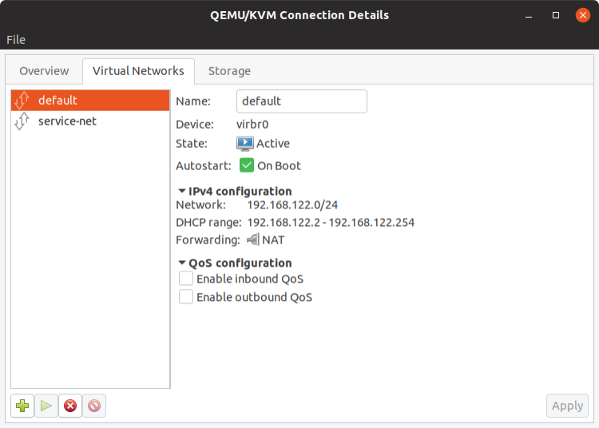
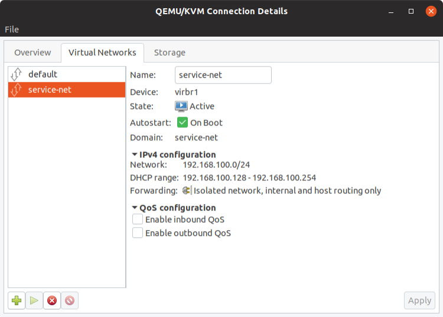
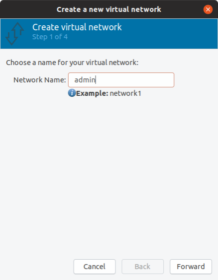
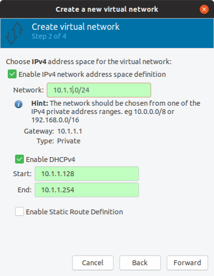
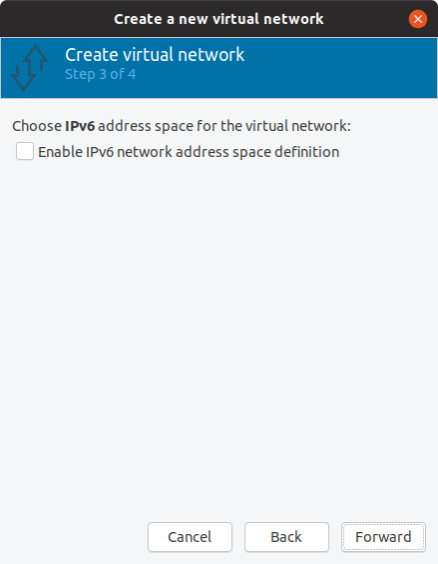
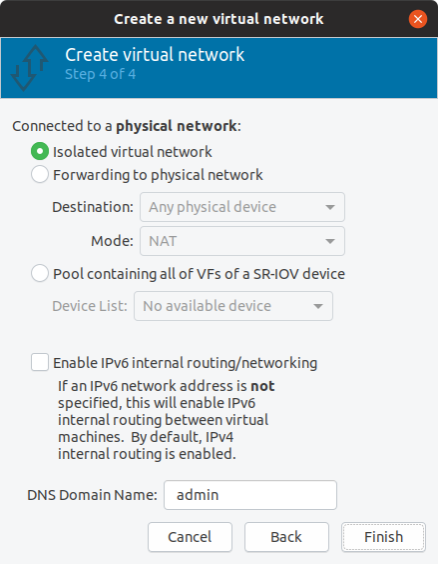

# Bridges and Networks

<br>

## Bridge

A bridge can be created either using Virtual Machine Manager, using virsh command line tool, by directly editing network scripts or using Linux Network management tools.

List all existing bridges on your system:

```bash
# brctl show
bridge name    bridge id STP enabled    interfaces
virbr0   8000.5254008a7dc1    yes virbr0-nic
virbr1   8000.5254001c3277    yes virbr1-nic
#
```

<br>

## Networks

A network is attached to a bridge.

net-list - List the virtual networks libvirt is aware of, along with some basic status and autostart flag information. Used without parameters it shows active virtual networks only.

```bash
# virsh net-list [--all] [--inactive].
```

Example:

```bash
# virsh net-list --all
 Name          State    Autostart   Persistent
------------------------------------------------
 default       active   yes         yes
 service-net   active   yes         yes

#
```

virt-manager is a graphical interface that can also be used:

Go to Edit > Connection Details – A popup will open with the list of all networks available:





<br>

## Create networks and bridges

<br>

### Using virsh (CLI)

The quickest way to get started is by utilizing existing default network configuration. 
Dump default network xml configuration using below command. You can edit this file accordingly and use it to define new network interface

```bash
# virsh net-dumpxml default > service-net.xml
```

Example:

```
<network>
  <name>default</name>
  <uuid>52c74ae6-2cac-49e9-96d5-232b409549be</uuid>
  <forward mode='nat'>
    <nat>
      <port start='1024' end='65535'/>
    </nat>
  </forward>
  <bridge name='virbr0' stp='on' delay='0'/>
  <mac address='52:54:00:8a:7d:c1'/>
  <ip address='192.168.122.1' netmask='255.255.255.0'>
    <dhcp>
      <range start='192.168.122.2' end='192.168.122.254'/>
    </dhcp>
  </ip>
</network>
```

Define network

Example of a new network service-net which is a network used for service-chaining between VMs (not attached to physical ports).

```
<network>
  <name>service-net</name>
  <uuid>4b67a6af-24d9-49a5-a3ed-abc6d1bc911d</uuid>
  <bridge name='virbr1' stp='on' delay='0'/>
  <mac address='52:54:00:1c:32:77'/>
  <domain name='service-net'/>
  <ip address='192.168.100.1' netmask='255.255.255.0'>
    <dhcp>
      <range start='192.168.100.128' end='192.168.100.254'/>
    </dhcp>
  </ip>
</network>
```

To define the service-net network from an XML file without starting it:

```bash
# virsh net-define service-net.xml
```

<br>

### Using virt-manager (Graphical)

Go to Edit > Connection Details – A popup will open with the list of all networks available:


Click on the green plus icon in the left bottom corner to create a new network and give it a name:



Click forward and define IPv4 parameters



Click Forward and define IPv6 parameters:



Now comes the interesting part. You need to decide whether this is going to be an isolated network with no outside access or one that can see the external traffic. Forwarding will allow KVM to send and receive packets to and from external networks. In the Destination dropdown list, you can choose with device you want to forward your virtual network to.
Click Forward and define if the new network is isolated (service chain) or attached to a port.



Click finish
A new network “admin” has been created and a new bridge virbr2:


### Monitoring

Using virsh CLI command:

```bash
# virsh net-list
 Name          State    Autostart   Persistent
------------------------------------------------
 admin         active   yes         yes
 default       active   yes         yes
 service-net   active   yes         yes

#
```

Example: Display details of new created network admin:

```bash
# virsh net-dumpxml admin
<network>
  <name>admin</name>
  <uuid>489b0f7b-87ac-4efb-a0de-7ef50e9dcdbc</uuid>
  <bridge name='virbr2' stp='on' delay='0'/>
  <mac address='52:54:00:16:8d:34'/>
  <domain name='admin'/>
  <ip address='10.1.1.1' netmask='255.255.255.0'>
    <dhcp>
      <range start='10.1.1.128' end='10.1.1.254'/>
    </dhcp>
  </ip>
</network>

#
```

<br>

## Start network

Start this network with the command net-start:

```bash
# net-start - Starts an inactive, previously defined virtual network.
```

virsh net-start [--network] <network-identifier>
Example:

```bash
# virsh net-start admin
```

<br>

## Stop an active network

net-destroy - Stops an active network and deallocates all resources used by it, e.g. stopping appropiate dnsmasq process, releasing the bridge. The virtual network being stopped can be persistent or transient.

```bash
# virsh net-destroy [--network] <network-identifier>
```


<br>


