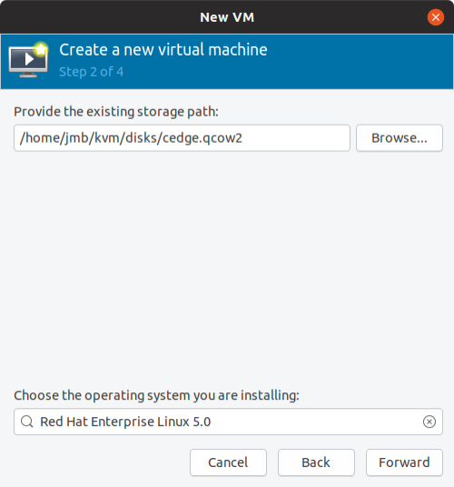
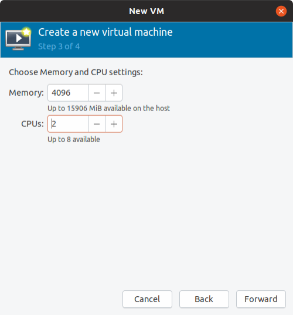
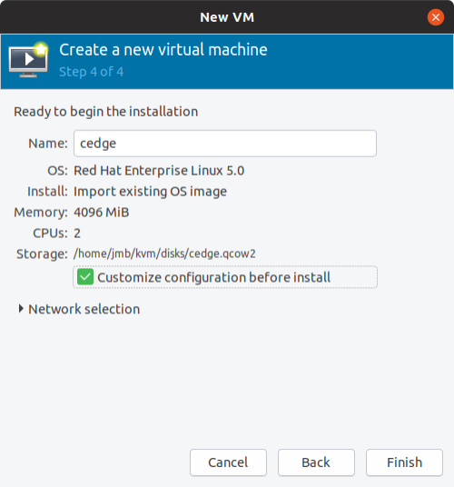
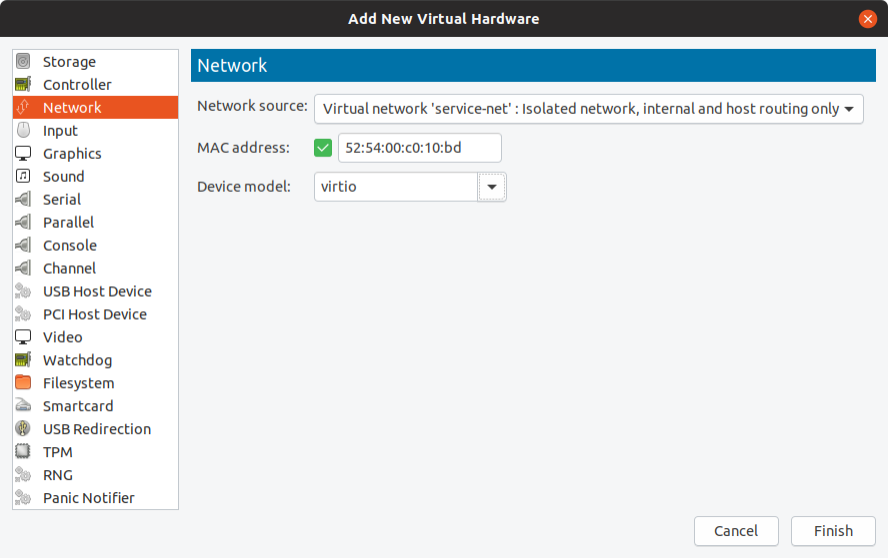

# Create and Boot CSR1000v (Controller Mode)

## 1. Bootstrap File

### Overview

Upon bootup, CSR1000v SD-WAN XE router will search bootflash: or usbflash: for filename ciscosdwan_cloud_init.cfg (make sure you use the exact same name). This file is the cloud-init file generated by vManage.

In a KVM (or OpenStack) context, CSR1000v/C8000v only supports file-based **config-drive** configuration, which is to say CSR1000v/C8000v does not generally support metadata or user_data as Day0 delivery mechanisms.

So the workflow is to generate the bootstrap config file (from vManage or linux tools), then create an iso image that contains this file. This will be mounted as a cdrom and used by cloud-init to bootstrap de VM.

The SD-WAN cloud-init file has two parts, cloud-config and cloud-boothook.

**text/cloud-config**

Contains the global parameters like uuid, token, org-name, vbond, cert etc

```
**MIME: text/cloud-config**
- Description:
- Root CA cert, viptela properties encoded in the part in YAML format and others.
     - ca-certs:
     - vinitparam
     - format-partition
     - otp
     - vbond
     - uuid
     - org
     - rcc
```

**text/cloud-boothook**

Contains the configuration of the device

```
**MIME: text/cloud-boothook**
  <Configuration of the node>
```

### cloud-config

From version 17.2, “rcc” became just a binary switch. When rcc has any values, cloud-init finds ca-certs. “rcc: 1” is enough, however by giving cert itself to rcc, it can work on previous versions as well. ca-certs can be configured in the general way of cloud-init.

[Example](https://cloudinit.readthedocs.io/en/latest/topics/examples.html)

**otp** is the one time password for cloud-vedge. Giving the chassis number as uuid and serial number as otp, vEdge boots up with those information already configured.

**vbond** is it’s vbond address, and org is Organization Name. When these are in cloud-config, vEdge is initialized with those information.

**format-partition**: 1 is specifically for vManage. With it, 2nd partition of HDD will be formatted automatically. Otherwise, VM will keep wait for user to confirm to format it and initialization stops.

### cloud-boothook

Each node has confd (Tail-F confd) inside, and it is the configuration database. Entered configuration here is imported into confd CDB when it is initialized.

<br>

## 2. Creating Bootstrap file from vManage

Create a Device Template and attach that template to your device. Enter all parameters and deploy.

Then go to Configuration > Device > WAN Edge List

Click on the 3-dots on the right of a device and pick "Generate bootstrap configuration"


For KVM and Openstack select Cloud-Init. (VMWare uses Encoded String). Then click OK.

You can either download the file and SCP it across to the host server, or copy and paste the contents via a terminal to the server. Use the method you are most comfortable with. That gives you the bootstrap config that you can apply when you instantiate the VM:


vManage will generate a cloud-init file that contains the cloud-config and cloud-boothook parts. This file is MIME encoded and can be used to load the VM (ciscosdwan_cloud_init.cfg file) or for hardware device (ciscosdwan.cfg). This file has to be copied to the flash. 

Once downloaded, you can then tune this file according to your needs.

The cloud-init config file will need to be named ciscosdwan_cloud_init.cfg for the CSR1000v to be able to load it.

<br>

## 3. Creating Bootstrap file using Linux tools

You can utilize “write-mime-multipart” application. It’s included in the cloud-utils package, so installation can be done in this way.

Ubuntu or Debian

```bash
# apt-get install cloud-utils
```

Redhat or CentOS

```bash
# yum install cloud-utils
```

You have to build 2 files:

+ cloud-config => cloud-config.txt
+ cloud-boothook => cloud-boothook.txt

The best option is to take a bootstrap file generated by vManage as a reference and change as required.

Example of cloud-config.txt:

```
#cloud-config
vinitparam:
 - uuid : CSR-E5E74EA5-B976-6584-CDFC-3D521AC73D24
 - vbond : 10.60.23.134
 - otp : 8c15259f59e7b815c8f272dbe58d3630
 - org : ADT Labs Paris
 - rcc : true
ca-certs:
  remove-defaults: false
  trusted:
  - |
   -----BEGIN CERTIFICATE-----
            [SNIP]
   -----END CERTIFICATE----------END CERTIFICATE-----
```

Example of cloud-boothook:

```
#cloud-boothook


viptela-system:system 
personality vedge
device-model vedge-cloud
vbond 10.60.23.134 port 12346
chassis-number CSR-E5E74EA5-B976-6584-CDFC-3D521AC73D24
ztp-status success
config-template-name "branch-vedge-single"
pseudo-confirm-commit 300
!
  viptela-system:system
   personality             vedge
   device-model            vedge-cloud
   host-name               vedge91
   system-ip               10.0.0.66
   domain-id               1
   site-id                 100
   no route-consistency-check
   sp-organization-name    "ADT Labs Paris"
   organization-name       "ADT Labs Paris"
   vbond 10.60.23.134 port 12346
   aaa
    auth-order local radius tacacs
    usergroup basic
     task system read write
     task interface read write
    !
    usergroup netadmin
    !
    usergroup operator
     task system read
     task interface read
     task policy read
     task routing read
     task security read
    !
    user admin
     password admin
    !
   !
   logging
    disk
     enable
    !
   !
  !
  omp
   no shutdown
   graceful-restart
   advertise connected
   advertise static
  !
  security
   ipsec
    authentication-type sha1-hmac ah-sha1-hmac
   !
  !
  vpn 0
   name "Transport VPN"
   interface ge0/0
    ip dhcp-client
    tunnel-interface
     encapsulation ipsec
     no allow-service bgp
     allow-service dhcp
     allow-service dns
     allow-service icmp
     allow-service sshd
     allow-service netconf
     allow-service ntp
     no allow-service ospf
     no allow-service stun
    !
    no shutdown
   !
  !
  vpn 512
   interface eth0
    ip address 10.1.1.1/24
    no shutdown
  !
 !
!
```

When you have each data in text files, you can combine them and construct a multipart text.

```bash
# write-mime-multipart --output=ciscosdwan_cloud_init.cfg cloud-config.txt:text/cloud-config cloud-boothook.txt:text/cloud-boothook
```

<br>

## 4. To pass Bootstrap File 

The CSR1000v/Catalyst8000v SD-WAN XE router will search for the filename ciscosdwan_cloud_init.cfg, which is the cloud-init file generated by vManage (or by linux tools). We need to create an iso image that contains this file. This will be mounted as a cdrom and used by cloud-init to bootstrap de VM.

Create the iso image to pass the ciscosdwan_cloud_init.cfg bootstrap file to cloud-init : 

```bash
# mkisofs -l -o config.iso ciscosdwan_cloud_init.cfg
```

This file config.iso will be used to create the CSR1000v with virt-install. The Bootstrap Configuration will be passed to the router at bootup.

<br>

**Note**: Do not use the following command:

```bash
# cloud-localds config.iso <configuration_filename>
```

That creates a cdrom image that contains 2 files:

- user-data
- metadata

This is used by vEdgeCloud.

<br>

## 5. Create and boot the CSR1000v SD-WAN using virt-install

Download image from CCO: https://software.cisco.com/download/home

Go to:

+ Downloads Home 
+ => Routers 
+ => Software-Defined WAN (SD-WAN) 
+ => XE SD-WAN Routers > CSR 1000V Series IOS XE SD-WAN

Then copy this file to KVM disk folder - this will be the image disk used by the CSR.

Example:

```bash
# cp csr1000v-ucmk9.16.12.1e-serial.qcow2 /home/jmb/kvm/disks/cedge.qcow2
```

<br>

Boot up the cEdge VM:

```bash
# virt-install \
    --name=cedge \
    --os-type=linux \
    --os-variant=rhel4.0 \
    --arch=x86_64 \
    --cpu host \
    --vcpus=2 \
    --hvm \
    --ram=4096 \
    --disk path=cedge.qcow2,size=16,device=disk,bus=ide,format=qcow2 \
    --network=network:default,model=virtio \
    --network=network:service-net,model=virtio \
    --graphics none \
    --import
```

Boot up the cEdge VM with Bootstrap Config as iso file:

```bash
# virt-install \
    --name=cedge \
    --os-type=linux \
    --os-variant=rhel4.0 \
    --arch=x86_64 \
    --cpu host \
    --vcpus=2 \
    --hvm \
    --ram=4096 \
    --disk path=cedge.qcow2,size=16,device=disk,bus=ide,format=qcow2 \
    --disk path=config.iso,device=cdrom \
    --network=network:default,model=virtio \
    --network=network:service-net,model=virtio \
    --graphics none \
    --import
```

Notes:

+ --import : skip the OS installation process, and build a guest around an existing disk image. The device used for booting is the first device specified via "--disk" or "--file".
+ --graphics none : disable graphics support and use text based console
+ --vnc : Setup a virtual console in the guest and export it as a VNC server in the host. Unless the "--vncport" parameter is also provided, the VNC server will run on the first free port number at 5900 or above. The actual VNC display allocated can be obtained using the "vncdisplay" command to "virsh" (or virt-viewer can be used which handles this detail for the use).
+ --vncport=VNCPORT : Request a permanent, statically assigned port number for the guest VNC console. Use of this option is discouraged as other guests may automatically choose to run on this port causing a clash.

Once you see the VM is booted up login with the username/password admin.

<br>


## 6. Create and boot the Cisco CSR 1000v SD-WAN using virt-manager

virt-manager, also known as Virtual Machine Manager, is a graphical tool for creating and managing guest virtual machines.

Step 1 - Launch the virt-manager GUI. Click Create a new virtual machine.


Step 2 - Do one of the following: 

+ For .qcow2: Select Import existing disk image.
+ For .iso: Select Local install media (ISO image or CDROM).
+ 

In this example, we want to import the qcow2 image.

Step 3 – Click on Browse to select the CSR qcow2 or iso file location.


Step4 - Click on Browse Local


Step5 - Select the disk image you want:


Step6 - Select the Operating System:



Step 7 - Configure the memory and CPU parameters.



Step 8 - Click “Customize configuration before install” and click finish.



Step 9 – By default there is one network interface mapped to network “default”. Click add Hardware to add a new network interface


Step 10 – Select the service-net network. The first default interface is mapped to “default”. Click finish.



Step 11 – Click Begin Installation on the top left corner of the window.


Once you see the VM is booted up login with the username/password admin.

<br>

## 7. Connect to console

List VMs running

```bash
# virsh list
 Id   Name                 State
------------------------------------
 2    cedge                running


#
```

List all VMs

```bash
# virsh list --all
 Id   Name                    State
----------------------------------------
 1    cedge                   running
 -    CSR-classic-16.11.01a   shut off
 -    CSR-classic-16.12.1a    shut off
 -    CSR-sdwan-16.12.1e      shut off

#
```

The default behaviour is to launch a VNC client to display the graphical console, or to run the "virsh" "console" command to display the text console.

The ```virsh console domain [--devname devicename] [--force] [--safe]``` command connects the virtual serial console for the guest virtual machine. This is very useful for example for guests that do not provide VNC or SPICE protocols (and thus does not offer video display for GUI tools) and that do not have network connection (and thus cannot be interacted with using SSH).

The optional ```--devname``` parameter refers to the device alias of an alternate console, serial, or parallel device configured for the guest virtual machine. If this parameter is omitted, the primary console will be opened. If the ```--safe``` option is specified, the connection is only attempted if the driver supports safe console handling. This option specifies that the server has to ensure exclusive access to console devices. Optionally, the force option may be specified, which requests to disconnect any existing sessions, such as in the case of a broken connection.

Connect to the console of the CSR1000v SD-WAN using the following command:

```bash
# virsh console cedge
Connected to domain CSR-sdwan-16.12.1e
Escape character is ^]
%IOSXEBOOT-4-BOOT_SRC: (rp/0): Checking grub versions 2.0 vs 2.0
%IOSXEBOOT-4-BOOT_SRC: (rp/0): Bootloader upgrade not necessary.


              Restricted Rights Legend


Use, duplication, or disclosure by the Government is
subject to restrictions as set forth in subparagraph
(c) of the Commercial Computer Software - Restricted
Rights clause at FAR sec. 52.227-19 and subparagraph
(c) (1) (ii) of the Rights in Technical Data and Computer
Software clause at DFARS sec. 252.227-7013.


           Cisco Systems, Inc.
           170 West Tasman Drive
           San Jose, California 95134-1706

```


## 8. VM Configuration File

Your VM config file which is in XML format. The config file is located at /etc/libvirt/qemu directory.

```bash
# ls -l /etc/libvirt/qemu
total 24
-rw------- 1 root root 3801 nov.  26 17:10 CSR-classic-16.11.01a.xml
-rw------- 1 root root 3758 nov.  26 17:20 CSR-classic-16.12.1a.xml
-rw------- 1 root root 3533 nov.  27 08:32 cedge.xml
-rw------- 1 root root 3533 nov.  27 08:32 cedge2.xml
drwxr-xr-x 3 root root 4096 sept. 20 13:19 networks/
#
```

This is an auto-generated file.

Changes to this xml configuration should be made using: 

```bash
# virsh edit cedge
```

The output is an xml representation of the virtual machine properties, or, using virsh terminology, a domain. If you want to change, for example, the number of vcpus, you just have to find the relevant tag and change the value.

Then reboot the virtual machine for the settings to be applied:

```bash
# virsh reboot cedge
```

<br>

## 9. Shutdown the VM

To shut down the VM

```bash
# virsh shutdown cedge
```

Brute force shutdown

```bash
# virsh destroy my_csr_vm
```

<br>

## 10. Cloning a guest

Another utility, virt-clone can be used to create a new virtual machine by cloning an existing one. To proceed, we must first ensure that the guest to be cloned is down, than we run:

```bash
# virt-clone \
—original=my_csr_vm \
—name=my_csr_vm_clone \
--file=/home/jmb/kvm/disks/CSR-classic.qcow2
```


<br>

