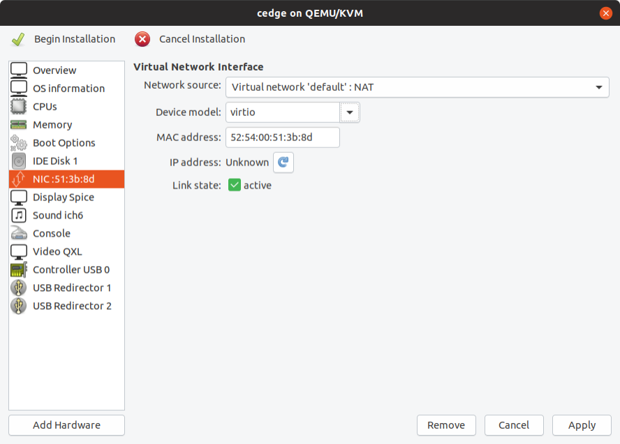

# Create and Boot CSR1000v

## Download CSR1000v SD-WAN Image

Download image from CCO: https://software.cisco.com/download/home

Go to:

+ Downloads Home 
+ => Routers 
+ => Software-Defined WAN (SD-WAN) 
+ => XE SD-WAN Routers > CSR 1000V Series IOS XE SD-WAN

=> csr1000v-ucmk9.16.12.1e-serial.qcow2

Then copy this file to KVM disk folder - this will be the image disk used by the CSR.

Example:

```bash
# cp csr1000v-ucmk9.16.12.1e-serial.qcow2 /home/jmb/kvm/disks/cedge.qcow2
```

## Create and boot the CSR1000v SD-WAN using virt-install

Boot up the cEdge VM:

```bash
# virt-install \
    --name=cedge \
    --os-type=linux \
    --os-variant=rhel4.0 \
    --arch=x86_64 \
    --cpu host \
    --vcpus=2 \
    --hvm \
    --ram=4096 \
    --disk path=cedge.qcow2,size=16,device=disk,bus=ide,format=qcow2 \
    --network=network:default,model=virtio \
    --network=network:service-net,model=virtio \
    --graphics none \
    --import
```

Boot up the cEdge VM with Bootstrap Config as iso file:

```bash
# virt-install \
    --name=cedge \
    --os-type=linux \
    --os-variant=rhel4.0 \
    --arch=x86_64 \
    --cpu host \
    --vcpus=2 \
    --hvm \
    --ram=4096 \
    --disk path=cedge.qcow2,size=16,device=disk,bus=ide,format=qcow2 \
    --disk path=config.iso,device=cdrom \
    --network=network:default,model=virtio \
    --network=network:service-net,model=virtio \
    --graphics none \
    --import
```

Notes:

+ --import : skip the OS installation process, and build a guest around an existing disk image. The device used for booting is the first device specified via "--disk" or "--file".
+ --graphics none : disable graphics support and use text based console
+ --vnc : Setup a virtual console in the guest and export it as a VNC server in the host. Unless the "--vncport" parameter is also provided, the VNC server will run on the first free port number at 5900 or above. The actual VNC display allocated can be obtained using the "vncdisplay" command to "virsh" (or virt-viewer can be used which handles this detail for the use).
+ --vncport=VNCPORT : Request a permanent, statically assigned port number for the guest VNC console. Use of this option is discouraged as other guests may automatically choose to run on this port causing a clash.

Once you see the VM is booted up login with the username/password admin.

<br>


## Creating the Cisco CSR 1000v VM Using Virtual Machine Manager (virt-manager)

virt-manager, also known as Virtual Machine Manager, is a graphical tool for creating and managing guest virtual machines.

Step 1 - Launch the virt-manager GUI. Click Create a new virtual machine.


Step 2 - Do one of the following: 

+ For .qcow2: Select Import existing disk image.
+ For .iso: Select Local install media (ISO image or CDROM).
+ 

In this example, we want to import the qcow2 image.

Step 3 – Click on Browse to select the CSR qcow2 or iso file location.


Step4 - Click on Browse Local


Step5 - Select the disk image you want:


Step6 - Select the Operating System:


Step 7 - Configure the memory and CPU parameters.


Step 8 - Click “Customize configuration before install” and click finish.


Step 9 – By default there is one network interface mapped to network “default”. Click add Hardware to add a new network interface



Step 10 – Select the service-net network. The first default interface is mapped to “default”. Click finish.


Step 11 – Click Begin Installation on the top left corner of the window.


Once you see the VM is booted up login with the username/password admin.

<br>


## VM List

List VMs running

```bash
# virsh list
 Id   Name                 State
------------------------------------
 2    cedge                running


#
```

List all VMs

```bash
# virsh list --all
 Id   Name                    State
----------------------------------------
 1    cedge                   running
 -    CSR-classic-16.11.01a   shut off
 -    CSR-classic-16.12.1a    shut off
 -    CSR-sdwan-16.12.1e      shut off

#
```

<br>

## Connect to console

The default behaviour is to launch a VNC client to display the graphical console, or to run the "virsh" "console" command to display the text console.

The ```virsh console domain [--devname devicename] [--force] [--safe]``` command connects the virtual serial console for the guest virtual machine. This is very useful for example for guests that do not provide VNC or SPICE protocols (and thus does not offer video display for GUI tools) and that do not have network connection (and thus cannot be interacted with using SSH).

The optional ```--devname``` parameter refers to the device alias of an alternate console, serial, or parallel device configured for the guest virtual machine. If this parameter is omitted, the primary console will be opened. If the ```--safe``` option is specified, the connection is only attempted if the driver supports safe console handling. This option specifies that the server has to ensure exclusive access to console devices. Optionally, the force option may be specified, which requests to disconnect any existing sessions, such as in the case of a broken connection.

Connect to the console of the CSR1000v SD-WAN using the following command:

```bash
# virsh console cedge
Connected to domain CSR-sdwan-16.12.1e
Escape character is ^]
%IOSXEBOOT-4-BOOT_SRC: (rp/0): Checking grub versions 2.0 vs 2.0
%IOSXEBOOT-4-BOOT_SRC: (rp/0): Bootloader upgrade not necessary.


              Restricted Rights Legend


Use, duplication, or disclosure by the Government is
subject to restrictions as set forth in subparagraph
(c) of the Commercial Computer Software - Restricted
Rights clause at FAR sec. 52.227-19 and subparagraph
(c) (1) (ii) of the Rights in Technical Data and Computer
Software clause at DFARS sec. 252.227-7013.


           Cisco Systems, Inc.
           170 West Tasman Drive
           San Jose, California 95134-1706

```


## VM Configuration File

Your VM config file which is in XML format. The config file is located at /etc/libvirt/qemu directory.

```bash
# ls -l /etc/libvirt/qemu
total 24
-rw------- 1 root root 3801 nov.  26 17:10 CSR-classic-16.11.01a.xml
-rw------- 1 root root 3758 nov.  26 17:20 CSR-classic-16.12.1a.xml
-rw------- 1 root root 3533 nov.  27 08:32 cedge.xml
-rw------- 1 root root 3533 nov.  27 08:32 cedge2.xml
drwxr-xr-x 3 root root 4096 sept. 20 13:19 networks/
#
```

This is an auto-generated file.

Changes to this xml configuration should be made using: 

```bash
# virsh edit cedge
```

The output is an xml representation of the virtual machine properties, or, using virsh terminology, a domain. If you want to change, for example, the number of vcpus, you just have to find the relevant tag and change the value.

Then reboot the virtual machine for the settings to be applied:

```bash
# virsh reboot cedge
```

<br>

## Shutdown the VM

To shut down the VM

```bash
# virsh shutdown cedge
```

Brute force shutdown

```bash
# virsh destroy my_csr_vm
```

<br>

## Cloning a guest

Another utility, virt-clone can be used to create a new virtual machine by cloning an existing one. To proceed, we must first ensure that the guest to be cloned is down, than we run:

```bash
# virt-clone \
—original=my_csr_vm \
—name=my_csr_vm_clone \
--file=/home/jmb/kvm/disks/CSR-classic.qcow2
```


<br>

