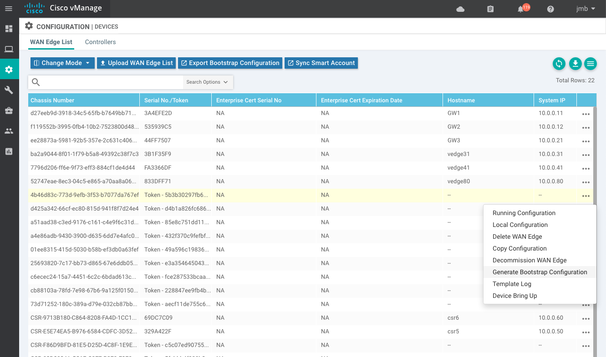

# Instantiate a vEdgeCloud

<br>

## Generate Bootstrap Configuration (cloud-init file)

To add a virtual edge you need to generate a bootstrap file. Navigate to the devices page under: Configuration > Devices > WAN Edge List

- Pick a vEdge Cloud
- Click on 3-dots ...
- Generate Bootstrap Configuration

Go to vManage > Devices

Select a vEdgeCloud that is available and generate the bootstrap config




A popup will appear:


For KVM select Cloud-Init. (VMWare uses Encoded String). Then click OK.

You can either download the file and SCP it across to the host server, or copy and paste the contents via a terminal to the server. Use the method you are most comfortable with. That gives you the bootstrap config that you can apply when you instantiate the VM:


<br>

## cloud-init file conversion to ISO

On the host server, create and ISO image from the cloud-init file that can be mounted to the vEdge on boot. I named the file vedge.cfg and copied it to the working directory.

```bash
# cloud-localds config.iso vedge.cfg
```

<br>

That creates a cdrom image that contains 2 files:

- user-data
- metadata

user-data - that is the bootstrap file generated by vManage

metadata - contains:

```
{

“Instance-id”: “iid-local01"

}
```

<br>

## Creating the VM Using virt-install

`virt-install` is a command line tool for creating new KVM , Xen or Linux container guests using the libvirt hypervisor management library. It allows you to create a VM and start an installation from the command line. `virt-install` command can creates the domain xml automatically from parameters.

cloud-init supports several ways to get the user-data. For example, with openstack, it can be retrieved from 169.254.169.254 address from metadata server.

The below is using the NoCloud method, and user-data is put into an ISO cdrom image.

Reference: http://cloudinit.readthedocs.io/en/latest/topics/datasources/nocloud.html

Boot the vEdge with the config.iso disk attached. This will ensure that the image boots with the correct chassis number.

```bash
# virt-install \
    --name vedge \
    --os-type linux \
    --os-variant ubuntu14.04 \
    --cpu host \
    --vcpus=2 \
    --hvm \
    --arch=x86_64 \
    --ram 2048 \
    --disk path=viptela-edge-19.1.0-genericx86-64.qcow2,size=16,device=disk,bus=ide,format=qcow2 \
    --disk path=config.iso,device=cdrom \
    --network=network:default,model=virtio \
    --network=network:default,model=virtio \
    --graphics none \
    --import
```

<br>

## Creating the VM Using Virtual Machine Manager (virt-manager)

virt-manager, also known as Virtual Machine Manager, is a graphical tool for creating and managing guest virtual machines.

- Step 1 - Launch the virt-manager GUI. Click Create a new virtual machine.

- Step 2 - Do one of the following: 
  - For .qcow2: Select Import existing disk image.
  - For .iso: Select Local install media (ISO image or CDROM).

- Step 3 - Select the qcow2 or iso file location.

- Step 4 - Configure the memory and CPU parameters.

- Step 5 - Configure virtual machine storage

- Step 6 - Click “Customize configuration before install”

- Step 7 - Click Finish.

- Step 8 -  Click Add Hardware to attach the ISO file you created.
  - In the Add New Virtual Hardware screen:
    - Click Storage on the left
    - Click “Select managed or     other existing storage"
    - Click Browse and select the     ISO file you created.
    - In the Device type field,     select IDE CDROM.
    - Click Finish.

<br>


<br>

## Access to the VM Console

```
# virsh console vedge-1
Connected to domain vedge-1

Escape character is ^]

viptela 18.3.0
```

 <br>

## Troubleshooting

Monitoring how internal cloud-init is/was working

cloud-init is an application working when booting up. The logs are remained in /var/log/messages. You can see any errors when it didn’t work as expected.

```
$ grep cloud-init /var/log/messages
```

<br>