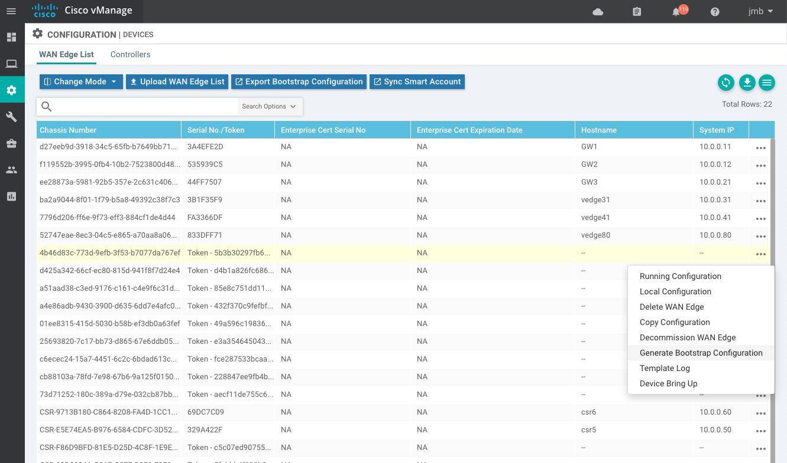
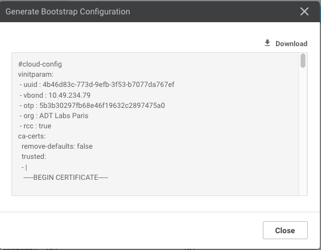
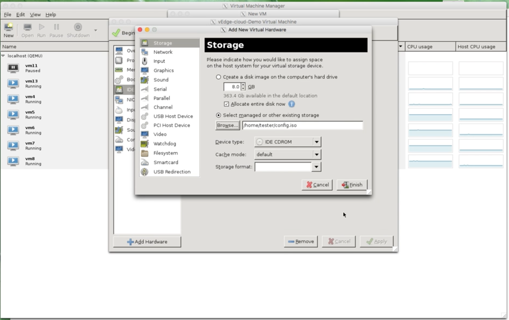

# Instantiate a vEdgeCloud

## 1. Bootstrap File

To instantiate a virtual edge with a day0 configuration, you need to generate a bootstrap file from vManage or with some linux tools. This bootstrap file is mime-encoded `user-data` used by cloud-init that contains 2 sections:

- \#cloud-config
- \#cloud-boothook

| MIME                | Description                                                  |
| ------------------- | ------------------------------------------------------------ |
| text/cloud-config   | Root CA cert, viptela properties encoded in the part in YAML format and others. <br />\- ca-certs:<br />\- vinitparam<br />\- format-partition<br />\- otp<br />\- vbond<br />\- uuid<br />\- org<br />\- rcc |
| text/cloud-boothook | Configuration of the node.                                   |

The cloud-init in Viptela VM's takes the passed user-data and recognize it as a multipart data.

<br>

## 2. Creating Bootstrap file from vManage

Create a Device Template and attach that template to your device. Enter all parameters and deploy.

Then go to Configuration > Device > WAN Edge List

Click on the 3-dots on the right of a device and pick "Generate bootstrap configuration"




A popup will appear:


For KVM and Openstack select Cloud-Init. (VMWare uses Encoded String). Then click OK.

You can either download the file and SCP it across to the host server, or copy and paste the contents via a terminal to the server. Use the method you are most comfortable with. That gives you the bootstrap config that you can apply when you instantiate the VM:



vManage will generate a cloud-init file that contains the cloud-config and cloud-boothook parts. This file is MIME encoded and can be used to load the VM.

<br>

## 3. Creating Bootstrap file using Linux tools

You can utilize “write-mime-multipart” application. It’s included in the cloud-utils package, so installation can be done in this way.

Ubuntu or Debian

```bash
# apt-get install cloud-utils
```

Redhat or CentOS

```bash
# yum install cloud-utils
```

You have to build 2 files:

+ cloud-config => cloud-config.txt
+ cloud-boothook => cloud-boothook.txt

When you have each data in text files, you can combine them and construct a multipart text.

```bash
# write-mime-multipart --output=vedge-user-data cloud-config.txt:text/cloud-config cloud-boothook.txt:text/cloud-boothook
```

<br>

refer to chapter 05 for more information. The procedure is the same.

<br>

## 4. cloud-init file conversion to ISO

Now we generate a seed disk that has the cloud-init metadata.`cloud-localds` creates a disk-image with user-data and/or meta-data for **cloud-init**. user-data can contain everything which is supported by cloud-init.

```bash
# cloud-localds config.iso vedge-user-data
```

That creates a cdrom image that contains 2 files:

- user-data
- meta-data

**user-data** file - that is the bootstrap file generated by vManage. This is a Mime Multi-part.

**meta-data** file - contains:

```
{

“Instance-id”: “iid-local01"

}
```

You can also use `genisoimage`:

```bash
# genisoimage  -output config.iso -volid cidata -joliet -rock user-data meta-data
```

user-data: user-data has to be in a file whose file name is "user-data". This is the file generated by vManage or with `write-mime-multipart`.

meta-data

```
instance-id: vedge1
local-hostname: vedge1
```

Note: Do NOT change the `-volid cidata` as the file system volume label must be set to `cidata`.

<br>

## 5. Creating the VM Using virt-install

`virt-install` is a command line tool for creating new KVM , Xen or Linux container guests using the libvirt hypervisor management library. It allows you to create a VM and start an installation from the command line. `virt-install` command can creates the domain xml automatically from parameters.

cloud-init supports several ways to get the user-data. For example, with openstack, it can be retrieved from 169.254.169.254 address from metadata server.

The below is using the NoCloud method, and user-data is put into an ISO cdrom image.

Reference: http://cloudinit.readthedocs.io/en/latest/topics/datasources/nocloud.html

Boot the vEdge with the config.iso disk attached. This will ensure that the image boots with the correct chassis number.

```bash
virt-install \
    --name=vedge \
    --ram=2048 \
    --vcpus=2 \
    --cpu host-passthrough \
    --arch=x86_64 \
    --os-type=linux \
    --os-variant=ubuntu14.04 \
    --boot hd \
    --disk path=../viptela-edge-20.4.1-genericx86-64.qcow2,format=qcow2,bus=virtio \
    --disk path=vedge-config.iso,device=cdrom \
    --network=network:default,model=virtio \
    --graphics none \
    --serial pty \
    --console pty \
    --noautoconsole
```

<br>

## 6. Creating the VM Using virt-manager

virt-manager, also known as Virtual Machine Manager, is a graphical tool for creating and managing guest virtual machines.

- Step 1 - Launch the virt-manager GUI. Click Create a new virtual machine.

- Step 2 - Do one of the following: 
  - For .qcow2: Select Import existing disk image.
  - For .iso: Select Local install media (ISO image or CDROM).

- Step 3 - Select the qcow2 or iso file location.

- Step 4 - Configure the memory and CPU parameters.

- Step 5 - Configure virtual machine storage

- Step 6 - Click “Customize configuration before install”

- Step 7 - Click Finish.

- Step 8 -  Click Add Hardware to attach the ISO file you created.
  - In the Add New Virtual Hardware screen:
    - Click Storage on the left
    - Click “Select managed or     other existing storage"
    - Click Browse and select the     ISO file you created.
    - In the Device type field,     select IDE CDROM.
    - Click Finish.



<br>

## 7. Access to the VM Console

```
# virsh console vedge-1
Connected to domain vedge-1

Escape character is ^]

viptela 18.3.0
```

 <br>

## 8. Troubleshooting

Monitoring how internal cloud-init is/was working

cloud-init is an application working when booting up. The logs are remained in /var/log/messages. You can see any errors when it didn’t work as expected.

```
$ grep cloud-init /var/log/messages
```

<br>