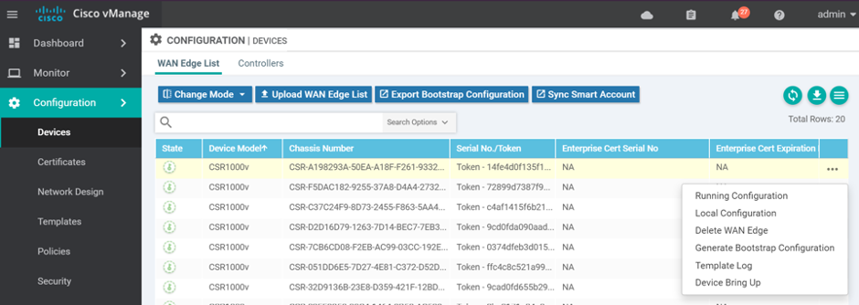
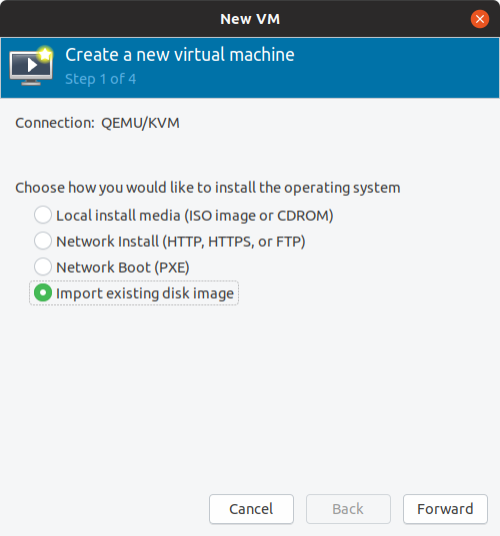

# Cisco CSR1000v KVM Deployment Guide


# INTRODUCTION

## Pre-requisites

This document assumes that you have the KVM hypervisor already installed along with the libvirt management application. Additionally, you will need the virt-install and cloud-localds CLI tools.

It is also assumed that you have downloaded the virtual disk images from https://software.cisco.com and the serial file from the PnP Portal with your Smart Account / Virtual Account.

## KVM

KVM has both GUI (virt-manager) and command line (virsh, virt-install) management tools, so you can choose whichever suits you best.

## CSR1000v Requirements

The Cisco CSR 1000v installation on KVM requires the manual creation of a VM and installation using the .iso file or the qcow2 file.
vCPU:
- 1 vCPU: requires minimum 4 GB RAM allocation
- 2 vCPUs: requires minimum 4 GB RAM allocation
- 4 vCPUs: requires minimum 4 GB RAM allocation

Virtual hard disk size—8 GB minimum

Supported vNICs—Virtio, ixgbe, ixgbevf or i40evf [TODO]

Maximum number of vNICs supported per VM instance—26 [TODO]


# Bridges and Networks

## Bridge

A bridge can be created either using Virtual Machine Manager, using virsh command line tool, by directly editing network scripts or using Linux Network management tools.

List all existing bridges on your system:
```bash
# brctl show
bridge name    bridge id STP enabled    interfaces
virbr0   8000.5254008a7dc1    yes virbr0-nic
virbr1   8000.5254001c3277    yes virbr1-nic
#
```

## Networks

A network is attached to a bridge.

net-list - List the virtual networks libvirt is aware of, along with some basic status and autostart flag information. Used without parameters it shows active virtual networks only.

```bash
# virsh net-list [--all] [--inactive].
```

Example:
```bash
# virsh net-list --all
 Name          State    Autostart   Persistent
------------------------------------------------
 default       active   yes         yes
 service-net   active   yes         yes

#
```

virt-manager is a graphical interface that can also be used:

Go to Edit > Connection Details – A popup will open with the list of all networks available:
 


## Create networks and bridges

### Using virsh (CLI)

The quickest way to get started is by utilizing existing default network configuration. 
Dump default network xml configuration using below command. You can edit this file accordingly and use it to define new network interface
```bash
# virsh net-dumpxml default > service-net.xml
```

Example:
```
<network>
  <name>default</name>
  <uuid>52c74ae6-2cac-49e9-96d5-232b409549be</uuid>
  <forward mode='nat'>
    <nat>
      <port start='1024' end='65535'/>
    </nat>
  </forward>
  <bridge name='virbr0' stp='on' delay='0'/>
  <mac address='52:54:00:8a:7d:c1'/>
  <ip address='192.168.122.1' netmask='255.255.255.0'>
    <dhcp>
      <range start='192.168.122.2' end='192.168.122.254'/>
    </dhcp>
  </ip>
</network>
```

Define network

Example of a new network service-net which is a network used for service-chaining between VMs (not attached to physical ports).
```
<network>
  <name>service-net</name>
  <uuid>4b67a6af-24d9-49a5-a3ed-abc6d1bc911d</uuid>
  <bridge name='virbr1' stp='on' delay='0'/>
  <mac address='52:54:00:1c:32:77'/>
  <domain name='service-net'/>
  <ip address='192.168.100.1' netmask='255.255.255.0'>
    <dhcp>
      <range start='192.168.100.128' end='192.168.100.254'/>
    </dhcp>
  </ip>
</network>
```

To define the service-net network from an XML file without starting it:
```bash
# virsh net-define service-net.xml
```

### Using virt-manager (Graphical)

Go to Edit > Connection Details – A popup will open with the list of all networks available:


Click on the green plus icon in the left bottom corner to create a new network and give it a name:


Click forward and define IPv4 parameters


Click Forward and define IPv6 parameters:


Now comes the interesting part. You need to decide whether this is going to be an isolated network with no outside access or one that can see the external traffic. Forwarding will allow KVM to send and receive packets to and from external networks. In the Destination dropdown list, you can choose with device you want to forward your virtual network to.
Click Forward and define if the new network is isolated (service chain) or attached to a port.


 
Click finish
A new network “admin” has been created and a new bridge virbr2:


 
Using virsh CLI command:
```bash
# virsh net-list
 Name          State    Autostart   Persistent
------------------------------------------------
 admin         active   yes         yes
 default       active   yes         yes
 service-net   active   yes         yes

#
```

Example: Display details of new created network admin:

```bash
# virsh net-dumpxml admin
<network>
  <name>admin</name>
  <uuid>489b0f7b-87ac-4efb-a0de-7ef50e9dcdbc</uuid>
  <bridge name='virbr2' stp='on' delay='0'/>
  <mac address='52:54:00:16:8d:34'/>
  <domain name='admin'/>
  <ip address='10.1.1.1' netmask='255.255.255.0'>
    <dhcp>
      <range start='10.1.1.128' end='10.1.1.254'/>
    </dhcp>
  </ip>
</network>

#
```

## Start network

Start this network with the command net-start:
```bash
# net-start - Starts an inactive, previously defined virtual network.
```

virsh net-start [--network] <network-identifier>
Example:
```bash
# virsh net-start admin
```

## Stop an active network

net-destroy - Stops an active network and deallocates all resources used by it, e.g. stopping appropiate dnsmasq process, releasing the bridge. The virtual network being stopped can be persistent or transient.

```bash
# virsh net-destroy [--network] <network-identifier>
```


<br>


# SR-IOV Interface

## SR-IOV Basics

SR-IOV provides the ability to partition a single physical PCI resource into virtual PCI functions which can then be injected into a VM. In the case of network VFs, SR-IOV improves north-south network performance (that is, traffic with endpoints outside the host machine) by allowing traffic to bypass the host machine’s network stack.

## More Information

Configure SR-IOV Network Virtual Functions in Linux* KVM
https://software.intel.com/en-us/articles/configure-sr-iov-network-virtual-functions-in-linux-kvm


<br>


# Cloud-init and Datasources

## Cloud-init

In a cloud environment, we use images to install systems. The system automation is generally done by cloud-init. Cloud-init was originally developed for Ubuntu GNU/Linux on the Amazon EC2 cloud. It has become the de facto installation configuration tool for most Unix-like systems on most cloud environments. 

Cloud-init is a tool used to perform initial setup on cloud nodes, including networking, SSH keys, timezone, user data injection, and more. It is a service that runs on the guest, and supports various Linux distributions including Fedora, RHEL, and Ubuntu, even Windows on the latest versions.

Cloud-init is the automated initialization of a new instance which is a task that needs to be split between the cloud infrastructure and the guest OS:
+ Hypervisor provides the required metadata via HTTP or via ConfigDrive 
+ Cloud-init takes care of configuring the instance on Linux.

Cloud-Init has different providers known as Datasources, which are sources of configuration data for Cloud-init that typically come from the user (user_data) or come from the stack that created the configuration drive (metadata). Typical userdata would include files, yaml, and shell scripts while typical metadata would include server name, instance id, display name and other cloud specific details.

SD-WAN controllers (vManage, vSmart and vBond), vEdge and cEdge are linux based system, and they have cloud-init configured inside. 
The bootstrap config is a MIME encoded file. See Cloudinit User-Data Formats:
+ https://cloudinit.readthedocs.io/en/latest/topics/format.html


## Datasources

Datasources are sources of configuration data for cloud-init that typically come from the user or come from the stack that created the configuration drive. Typical userdata would include files, yaml, and shell scripts while typical metadata would include server name, instance id, display name and other cloud specific details. Since there are multiple ways to provide this data (each cloud solution seems to prefer its own way) internally a datasource abstract class was created to allow for a single way to access the different cloud systems methods to provide this data through the typical usage of subclasses.

## Config-Drive

It is a kind of configuration provider for Cloud-Init used by OpenStack. Config Drive is a data source which reads a local ‘CD-Rom’ device which contains the metadata for the Virtual Machine. This allows for auto configuration of Virtual Machines without them requiring network.

## Cloud-Config

It is format implementing a declarative syntax for many common configuration items for Cloud-Init, making it easy to accomplish many tasks. It also allows you to specify arbitrary commands for anything that falls outside of the predefined declarative capabilities. Let's say, it is a YAML configuration file for Cloud-Init.


<br>


# CSR1000v SD-WAN Bootstrap Configuration

## Bootstrap File

Upon bootup, CSR1000v SD-WAN XE router will search bootflash: or usbflash: for filename ciscosdwan_cloud_init.cfg (make sure you use the exact same name). This file is the cloud-init file generated by vManage.

The SD-WAN cloud-init file has two parts, cloud-config and cloud-boothook.

**text/cloud-config**

Contains the global parameters like uuid, token, org-name, vbond, cert etc
```
**MIME: text/cloud-config**
- Description:
- Root CA cert, viptela properties encoded in the part in YAML format and others.
     - ca-certs:
     - vinitparam
     - format-partition
     - otp
     - vbond
     - uuid
     - org
     - rcc
```

**text/cloud-boothook**

Contains the configuration of the device
```
**MIME: text/cloud-boothook**
  <Configuration of the node>
```


## cloud-config

From version 17.2, “rcc” became just a binary switch. When rcc has any values, cloud-init finds ca-certs. “rcc: 1” is enough, however by giving cert itself to rcc, it can work on previous versions as well. ca-certs can be configured in the general way of cloud-init.

[Example](https://cloudinit.readthedocs.io/en/latest/topics/examples.html)

**otp** is the one time password for cloud-vedge. Giving the chassis number as uuid and serial number as otp, vEdge boots up with those information already configured.

**vbond** is it’s vbond address, and org is Organization Name. When these are in cloud-config, vEdge is initialized with those information.

**format-partition**: 1 is specifically for vManage. With it, 2nd partition of HDD will be formatted automatically. Otherwise, VM will keep wait for user to confirm to format it and initialization stops.


## cloud-boothook

Each node has confd (Tail-F confd) inside, and it is the configuration database. Entered configuration here is imported into confd CDB when it is initialized.


## Creating Bootstrap file from vManage

Create a Device Template and attach that template to your device. Enter all parameters and deploy.

Then go to Configuration > Device > WAN Edge List

Click on the 3-dots on the right of a device and pick "Generate bootstrap configuration"



For KVM select Cloud-Init. (VMWare uses Encoded String). Then click OK.


vManage will generate a cloud-init file that contains the cloud-config and cloud-boothook parts. This file is MIME encoded and can be used to load the VM (ciscosdwan_cloud_init.cfg file) or for hardware device (ciscosdwan.cfg). This file has to be copied to the flash. 

Once downloaded, you can then tune this file according to your needs.

The cloud-init config file will need to be named ciscosdwan_cloud_init.cfg for the CSR1000v to be able to load it.


## Creating Bootstrap file using Linux tools

You can utilize “write-mime-multipart” application. It’s included in the cloud-utils package, so installation can be done in this way.

Ubuntu or Debian
```bash
# apt-get install cloud-utils
```

Redhat or CentOS
```bash
# yum install cloud-utils
```

You have to build 2 files:
+ cloud-config => cloud-config.txt
+ cloud-boothook => cloud-boothook.txt

The best option is to take a bootstrap file generated by vManage as a reference and change as required.

Example of cloud-config.txt:
```
#cloud-config
vinitparam:
 - uuid : CSR-E5E74EA5-B976-6584-CDFC-3D521AC73D24
 - vbond : 10.60.23.134
 - otp : 8c15259f59e7b815c8f272dbe58d3630
 - org : ADT Labs Paris
 - rcc : true
ca-certs:
  remove-defaults: false
  trusted:
  - |
   -----BEGIN CERTIFICATE-----
            [SNIP]
   -----END CERTIFICATE----------END CERTIFICATE-----
```

Example of cloud-boothook:
```
#cloud-boothook


viptela-system:system 
personality vedge
device-model vedge-cloud
vbond 10.60.23.134 port 12346
chassis-number CSR-E5E74EA5-B976-6584-CDFC-3D521AC73D24
ztp-status success
config-template-name "branch-vedge-single"
pseudo-confirm-commit 300
!
  viptela-system:system
   personality             vedge
   device-model            vedge-cloud
   host-name               vedge91
   system-ip               10.0.0.66
   domain-id               1
   site-id                 100
   no route-consistency-check
   sp-organization-name    "ADT Labs Paris"
   organization-name       "ADT Labs Paris"
   vbond 10.60.23.134 port 12346
   aaa
    auth-order local radius tacacs
    usergroup basic
     task system read write
     task interface read write
    !
    usergroup netadmin
    !
    usergroup operator
     task system read
     task interface read
     task policy read
     task routing read
     task security read
    !
    user admin
     password admin
    !
   !
   logging
    disk
     enable
    !
   !
  !
  omp
   no shutdown
   graceful-restart
   advertise connected
   advertise static
  !
  security
   ipsec
    authentication-type sha1-hmac ah-sha1-hmac
   !
  !
  vpn 0
   name "Transport VPN"
   interface ge0/0
    ip dhcp-client
    tunnel-interface
     encapsulation ipsec
     no allow-service bgp
     allow-service dhcp
     allow-service dns
     allow-service icmp
     allow-service sshd
     allow-service netconf
     allow-service ntp
     no allow-service ospf
     no allow-service stun
    !
    no shutdown
   !
  !
  vpn 512
   interface eth0
    ip address 10.1.1.1/24
    no shutdown
  !
 !
!
```

When you have each data in text files, you can combine them and construct a multipart text.
```bash
# write-mime-multipart --output=ciscosdwan_cloud_init.cfg cloud-config.txt:text/cloud-config cloud-boothook.txt:text/cloud-boothook
```


## Config drive - To pass Bootstrap File 

As seen before, upon bootup, CSR1000v SD-WAN XE router will search for filename ciscosdwan_cloud_init.cfg, which is the cloud-init file generated by vManage (or by linux tools). We need to create an iso image that contains this file. This will be mounted as a cdrom and used by cloud-init to bootstrap de VM.

Create the iso image to pass the ciscosdwan_cloud_init.cfg bootstrap file to cloud-init : 
```bash
# mkisofs -l -o config.iso ciscosdwan_cloud_init.cfg
```

This tool does not work:
```bash
# cloud-localds config.iso <configuration_filename>
```

This file config.iso will be used to create the CSR1000v with virt-install. The Bootstrap Configuration will be passed to the router and installed in the bootflash.

Note: 
+ cEdge on OpenStack: Support for config drive-provided SDWAN Day0 config file: https://cdetsng.cisco.com/summary/#/defect/CSCvo42416


<br>


# Create and Boot CSR1000v

## Download CSR1000v SD-WAN Image

Download image from CCO: https://software.cisco.com/download/home

Go to:
+ Downloads Home 
+ => Routers 
+ => Software-Defined WAN (SD-WAN) 
+ => XE SD-WAN Routers > CSR 1000V Series IOS XE SD-WAN

=> csr1000v-ucmk9.16.12.1e-serial.qcow2

Then copy this file to KVM disk folder - this will be the image disk used by the CSR.

Example:
```bash
# cp csr1000v-ucmk9.16.12.1e-serial.qcow2 /home/jmb/kvm/disks/cedge.qcow2
```

## Create and boot the CSR1000v SD-WAN using virt-install

Boot up the cEdge VM:
```bash
# virt-install \
    --name=cedge \
    --os-type=linux \
    --os-variant=rhel4 \
    --arch=x86_64 \
    --cpu host \
    --vcpus=2 \
    --hvm \
    --ram=4096 \
    --disk path=cedge.qcow2,size=16,device=disk,bus=ide,format=qcow2 \
    --network=network:default,model=virtio \
    --network=network:service-net,model=virtio \
    --graphics none \
    --import
```

Boot up the cEdge VM with Bootstrap Config as iso file:
```bash
# virt-install \
    --name=cedge \
    --os-type=linux \
    --os-variant=rhel4 \
    --arch=x86_64 \
    --cpu host \
    --vcpus=2 \
    --hvm \
    --ram=4096 \
    --disk path=cedge.qcow2,size=16,device=disk,bus=ide,format=qcow2 \
    --disk path=config.iso,device=cdrom \
    --network=network:default,model=virtio \
    --network=network:service-net,model=virtio \
    --graphics none \
    --import
```

Notes:
+ --import : skip the OS installation process, and build a guest around an existing disk image. The device used for booting is the first device specified via "--disk" or "--file".
+ --graphics none : disable graphics support and use text based console
+ --vnc : Setup a virtual console in the guest and export it as a VNC server in the host. Unless the "--vncport" parameter is also provided, the VNC server will run on the first free port number at 5900 or above. The actual VNC display allocated can be obtained using the "vncdisplay" command to "virsh" (or virt-viewer can be used which handles this detail for the use).
+ --vncport=VNCPORT : Request a permanent, statically assigned port number for the guest VNC console. Use of this option is discouraged as other guests may automatically choose to run on this port causing a clash.

Once you see the VM is booted up login with the username/password admin.


## Creating the Cisco CSR 1000v VM Using Virtual Machine Manager (virt-manager)

virt-manager, also known as Virtual Machine Manager, is a graphical tool for creating and managing guest virtual machines.

Step 1 - Launch the virt-manager GUI. Click Create a new virtual machine.


Step 2 - Do one of the following: 
+ For .qcow2: Select Import existing disk image.
+ For .iso: Select Local install media (ISO image or CDROM).
+ 


In this example, we want to import the qcow2 image.
 
Step 3 – Click on Browse to select the CSR qcow2 or iso file location.


Step4 - Click on Browse Local


Step5 - Select the disk image you want:


Step6 - Select the Operating System:


Step 7 - Configure the memory and CPU parameters.


Step 8 - Click “Customize configuration before install” and click finish.


Step 9 – By default there is one network interface mapped to network “default”. Click add Hardware to add a new network interface


 
Step 10 – Select the service-net network. The first default interface is mapped to “default”. Click finish.


 
Step 11 – Click Begin Installation on the top left corner of the window.


 
Once you see the VM is booted up login with the username/password admin.


## VM List

List VMs running

```bash
# virsh list
 Id   Name                 State
------------------------------------
 2    cedge                running


#
```

List all VMs
```bash
# virsh list --all
 Id   Name                    State
----------------------------------------
 1    cedge                   running
 -    CSR-classic-16.11.01a   shut off
 -    CSR-classic-16.12.1a    shut off
 -    CSR-sdwan-16.12.1e      shut off

#
```


## Connect to console

The default behaviour is to launch a VNC client to display the graphical console, or to run the "virsh" "console" command to display the text console.

The ```virsh console domain [--devname devicename] [--force] [--safe]``` command connects the virtual serial console for the guest virtual machine. This is very useful for example for guests that do not provide VNC or SPICE protocols (and thus does not offer video display for GUI tools) and that do not have network connection (and thus cannot be interacted with using SSH).

The optional ```--devname``` parameter refers to the device alias of an alternate console, serial, or parallel device configured for the guest virtual machine. If this parameter is omitted, the primary console will be opened. If the ```--safe``` option is specified, the connection is only attempted if the driver supports safe console handling. This option specifies that the server has to ensure exclusive access to console devices. Optionally, the force option may be specified, which requests to disconnect any existing sessions, such as in the case of a broken connection.

Connect to the console of the CSR1000v SD-WAN using the following command:
```bash
# virsh console cedge
Connected to domain CSR-sdwan-16.12.1e
Escape character is ^]
%IOSXEBOOT-4-BOOT_SRC: (rp/0): Checking grub versions 2.0 vs 2.0
%IOSXEBOOT-4-BOOT_SRC: (rp/0): Bootloader upgrade not necessary.


              Restricted Rights Legend


Use, duplication, or disclosure by the Government is
subject to restrictions as set forth in subparagraph
(c) of the Commercial Computer Software - Restricted
Rights clause at FAR sec. 52.227-19 and subparagraph
(c) (1) (ii) of the Rights in Technical Data and Computer
Software clause at DFARS sec. 252.227-7013.


           Cisco Systems, Inc.
           170 West Tasman Drive
           San Jose, California 95134-1706

```


## VM Configuration File

Your VM config file which is in XML format. The config file is located at /etc/libvirt/qemu directory.
```bash
# ls -l /etc/libvirt/qemu
total 24
-rw------- 1 root root 3801 nov.  26 17:10 CSR-classic-16.11.01a.xml
-rw------- 1 root root 3758 nov.  26 17:20 CSR-classic-16.12.1a.xml
-rw------- 1 root root 3533 nov.  27 08:32 cedge.xml
-rw------- 1 root root 3533 nov.  27 08:32 cedge2.xml
drwxr-xr-x 3 root root 4096 sept. 20 13:19 networks/
#
```

This is an auto-generated file.

Changes to this xml configuration should be made using: 
```bash
# virsh edit cedge
```

The output is an xml representation of the virtual machine properties, or, using virsh terminology, a domain. If you want to change, for example, the number of vcpus, you just have to find the relevant tag and change the value.

Then reboot the virtual machine for the settings to be applied:
```bash
# virsh reboot cedge
```


## Shutdown the VM

To shut down the VM
```bash
# virsh shutdown cedge
```
Brute force shutdown
```bash
# virsh destroy my_csr_vm
```


## Cloning a guest

Another utility, virt-clone can be used to create a new virtual machine by cloning an existing one. To proceed, we must first ensure that the guest to be cloned is down, than we run:
```bash
# virt-clone \
—original=my_csr_vm \
—name=my_csr_vm_clone \
--file=/home/jmb/kvm/disks/CSR-classic.qcow2
```


<br>


# Increasing Performance on KVM Configurations

## Introduction

You can increase the performance for a Cisco CSR 1000v in a KVM environment by changing settings on the KVM host. These settings are independent of the Cisco IOS XE configuration settings on the Cisco CSR 1000v.

You can improve performance on KVM configurations by "Enabling CPU Pinning" as follows. Increase the performance for KVM environments by using the KVM CPU Affinity option to assign a virtual machine to a specific processor. To use this option, configure CPU pinning on the KVM host.


## Node Capabilities

In the KVM host environment, verify the host topology to find out how many vCPUs are available for pinning by using the following command:
```bash
# virsh nodeinfo
```

Example:
```bash
# virsh nodeinfo
CPU model:           x86_64
CPU(s):              8
CPU frequency:       1531 MHz
CPU socket(s):       1
Core(s) per socket:  4
Thread(s) per core:  2
NUMA cell(s):        1
Memory size:         16262980 KiB

#
```

Use the following command to verify the available vCPU numbers:
```bash
#virsh capabilities
```


## vCPU Pinning

Use the following command to pin the virtual CPUs to sets of processor cores:
```bash
# virsh vcpupin <vmname > <vcpu# > <host core# >
```

This KVM command must be executed for each vCPU on your Cisco CSR 1000v. The following example pins virtual CPU 1 to host core 3:
virsh vcpupin csr1000v 1 3

The following example shows the KVM commands needed if you have a Cisco CSR 1000v configuration with four vCPUs and the host has eight cores:
```bash
# virsh vcpupin csr1000v 0 2
# virsh vcpupin csr1000v 1 3
# virsh vcpupin csr1000v 2 4
# virsh vcpupin csr1000v 3 5
```

The host core number can be any number from 0 to 7. For more information, see the KVM documentation.


<br>


# Router Network Interfaces and vNICs

## Router Interface to vNICs Mapping

The Cisco CSR 1000v maps the GigabitEthernet network interfaces to the logical virtual network interface card (vNIC) name assigned by the VM. The VM in turn maps the logical vNIC name to a physical MAC address.

When the Cisco CSR 1000v is booted for the first time, the router interfaces are mapped to the logical vNIC interfaces that were added when the VM was created. 

Check interface database:
```
Router#show platform software vnic-if database
vNIC Database
  eth00_1574864470089641086
    Device Name : Gi1
    Driver Name : virtio_net
    MAC Address : 5254.00d5.2445
    PCI DBDF    : 0000:00:02.0
    UIO device  : yes
    Management  : no
    Status      : supported
  eth01_1574864470572014629
    Device Name : Gi2
    Driver Name : virtio_net
    MAC Address : 5254.00c0.89d3
    PCI DBDF    : 0000:00:03.0
    UIO device  : yes
    Management  : no
    Status      : supported

Router#
```

Check Interface Mapping using the ```show platform software vnic-if interface-mapping```

Example:
```
Router#show platform software vnic-if interface-mapping
-------------------------------------------------------------
 Interface Name        Driver Name         Mac Addr
-------------------------------------------------------------
 GigabitEthernet2       net_virtio         5254.0089.16e8
 GigabitEthernet1       net_virtio         5254.003b.0978
-------------------------------------------------------------

Router#
```

Configure interface GigabitEthernet1 and GigabitEthernet2 with DHCP using config-transaction:
```
interface GigabitEthernet1
 no shutdown
 ip address dhcp
 no mop enabled
 no mop sysid
 negotiation auto
exit
interface GigabitEthernet2
 no shutdown
 ip address dhcp
 no mop enabled
 no mop sysid
 negotiation auto
exit
```

After a couple of seconds:
+ an IP address is assigned to GigabitEthernet 1 from the network default pool – GigabitEthernet 1 is mapped to network default
+ an IP address is assigned to GigabitEthernet 2 from the network service-net pool – GigabitEthernet 2 is mapped to network service-net

```
Router#show ip int brief
Interface              IP-Address      OK? Method Status                Protocol
GigabitEthernet1       192.168.122.208 YES DHCP   up                    up
GigabitEthernet2       192.168.100.135 YES DHCP   up                    up
Loopback65528          192.168.1.1     YES other  up                    up
Router#
```

You can get these addresses from virsh CLI command:
```bash
# virsh domifaddr cedge
 Name       MAC address          Protocol     Address
-------------------------------------------------------------------------------
 vnet0      52:54:00:d5:24:45    ipv4         192.168.122.208/24
 vnet1      52:54:00:c0:89:d3    ipv4         192.168.100.135/24

#
```


## Attach VM to NIC

In this example, I’ll attach br1 interface to the vm pxe that will be configured as Preboot eXecution Environment server.
+ This takes effect immediately, and the NIC will be persistent on further reboots.
+ Attach the interface as below:

```bash
# sudo virsh attach-interface --domain pxe --type bridge \
--source br1 --model virtio --config --live  
```

```bash
# sudo virsh domiflist pxe
Interface  Type       Source     Model       MAC
-------------------------------------------------------
vnet0      bridge     virbr0     virtio      52:54:00:e9:ad:17
vnet1      bridge     br1        virtio      52:54:00:47:2f:eb
```

Detaching an interface attached to a VM
```bash
# virsh detach-interface --domain pxe --type bridge --mac 52:54:00:47:2f:eb --config
```


## Determine the Active vCPU Distribution Template

To determine which template is being used for vCPU distribution, use the following command:
```show platform software cpu alloc```

Example:
```
Router#show platform software cpu alloc
CPU alloc information:
  Control plane cpu alloc: 0
  Data plane cpu alloc: 1
  Service plane cpu alloc: 0
  Template used: None
Router#
```

The Control plane and the Service plane share cores 0.


## Adding Bootstrap File to the flash (Option)

If you did not provide the Bootstrap Config as iso file (mounted as CDROM) during the VM creation, you can still copy the bootstrap file into the file and reset the router to start from scratch. If there is no config in NVRAM, then the SD-WAN router will search bootflash: or usbflash: for filename ciscosdwan_cloud_init.cfg

Copy the bootstrap file generated by vManage or created using Linux tools into the router bootflash – Make sure you use the exact name: ciscosdwan_cloud_init.cfg

```
Router#copy scp: bootflash:
Address or name of remote host []? 192.168.1.107
Source username [admin]? jmb
Source filename []? CSR-cloudinit-KVM.txt
Destination filename [CSR-cloudinit-KVM.txt]? ciscosdwan_cloud_init.cfg
Password:
 Sending file modes: C0644 7569 CSR-cloudinit-KVM.txt
!
7569 bytes copied in 9.024 secs (839 bytes/sec)
Router#
```

Reset the SDWAN software in order for the chassis serial number from the ciscosdwan_cloud_init.cfg file to be applied to the device.
```request platform software sdwan software reset```

Once the router is back online, login and confirm that the chassis number is the same as the one from the Bootstrap File.
Check handling of ciscosdwan_cloud_init.cfg file

```
Router#show log process plogd internal | i sdwan|Fail
```

[TODO]
Add certificate process


# Troubleshooting commands

In the KVM host environment, verify the host topology to find out how many vCPUs are available for pinning by using the following command:

```virsh nodeinfo```

Use the following command to pin the virtual CPUs to sets of processor cores:
```virsh vcpupin <vmname > <vcpu# > <host core# >```

This KVM command must be executed for each vCPU on your Cisco CSR 1000v. The following example pins virtual CPU 1 to host core 3:
```virsh vcpupin csr1000v 1 3```

The following example shows the KVM commands needed if you have a Cisco CSR 1000v configuration with four vCPUs and the host has eight cores:
```bash
# virsh vcpupin csr1000v 0 2
# virsh vcpupin csr1000v 1 3
# virsh vcpupin csr1000v 2 4
# virsh vcpupin csr1000v 3 5
```

## List VMs 

List VM running:
```bash
# virsh list
 Id   Name                 State
------------------------------------
 2    CSR-sdwan-16.12.1e   running

#
```

List all VMs
```bash
# virsh list --all
 Id   Name                    State
----------------------------------------
 1    my_csr_vm               running
 -    CSR-classic-16.11.01a   shut off
 -    CSR-classic-16.12.1a    shut off
 -    CSR-sdwan-16.12.1e      shut off


#
```

## Change some guest machine parameters

Your VM config file which is in XML format. The config file is located at /etc/libvirt/qemu directory.
```bash
# ls -l /etc/libvirt/qemu
total 24
-rw------- 1 root root 3801 nov.  26 17:10 CSR-classic-16.11.01a.xml
-rw------- 1 root root 3758 nov.  26 17:20 CSR-classic-16.12.1a.xml
-rw------- 1 root root 5735 nov.  26 17:38 CSR-sdwan-16.12.1e.xml
-rw------- 1 root root 3533 nov.  27 08:32 my_csr_vm.xml
drwxr-xr-x 3 root root 4096 sept. 20 13:19 networks
#
```

This is an auto-generated file.

Changes to this xml configuration should be made using:
```virsh edit my_csr_vm```

The output is an xml representation of the virtual machine properties, or, using virsh terminology, a domain. If you want to change, for example, the number of vcpus, you just have to find the relevant tag and change the value.
Then reboot the virtual machine for the settings to be applied: ```virsh reboot my_csr_vm```


## Shutdown the VM

Shut down the guest
```bash
# virsh shutdown my_csr_vm
```

Brute force shutdown
```bash
#virsh destroy my_csr_vm
```


## Cloning a guest

Another utility, virt-clone can be used to create a new virtual machine by cloning an existing one. To proceed, we must first ensure that the guest to be cloned is down, than we run:
```bash
# virt-clone \
—original=my_csr_vm \
—name=my_csr_vm_clone \
--file=/home/jmb/kvm/disks/CSR-classic.qcow2
```

## Getting Information on the VM

Using virsh to find out the IP address of a Virtual Machine
```virsh domifaddr cedge```

Example:
```bash
# virsh domifaddr  vEdge
 Name       MAC address          Protocol     Address
-------------------------------------------------------------------------------
 vnet0      52:54:00:70:b4:84    ipv4         192.168.122.224/24

#
```

Use the virsh vncdisplay vm-name to get the VNC port number (if VNC is used and has been defined when creating the VM)
```bash
# virsh vncdisplay cedge
:0

#
```

## Connect to console

```bash
# virsh console cedge
Connected to domain CSR-sdwan-16.12.1e
Escape character is ^]
%IOSXEBOOT-4-BOOT_SRC: (rp/0): Checking grub versions 2.0 vs 2.0
%IOSXEBOOT-4-BOOT_SRC: (rp/0): Bootloader upgrade not necessary.


              Restricted Rights Legend


Use, duplication, or disclosure by the Government is
subject to restrictions as set forth in subparagraph
(c) of the Commercial Computer Software - Restricted
Rights clause at FAR sec. 52.227-19 and subparagraph
(c) (1) (ii) of the Rights in Technical Data and Computer
Software clause at DFARS sec. 252.227-7013.


           Cisco Systems, Inc.
           170 West Tasman Drive
           San Jose, California 95134-1706

#
```

## Remove VM

To cleanly remove a vm including its storage columes, use the commands shown below.
```bash
# sudo virsh destroy cedge 2> /dev/null
# sudo virsh undefine  cedge
# sudo virsh pool-refresh default
# sudo virsh vol-delete --pool default /home/jmb/kvm/disks/cedge.qcow2
```

