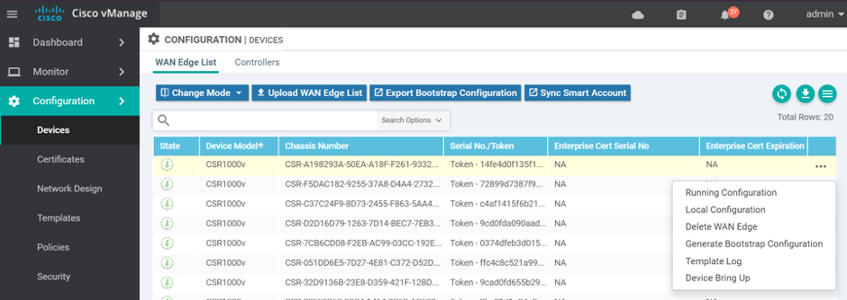
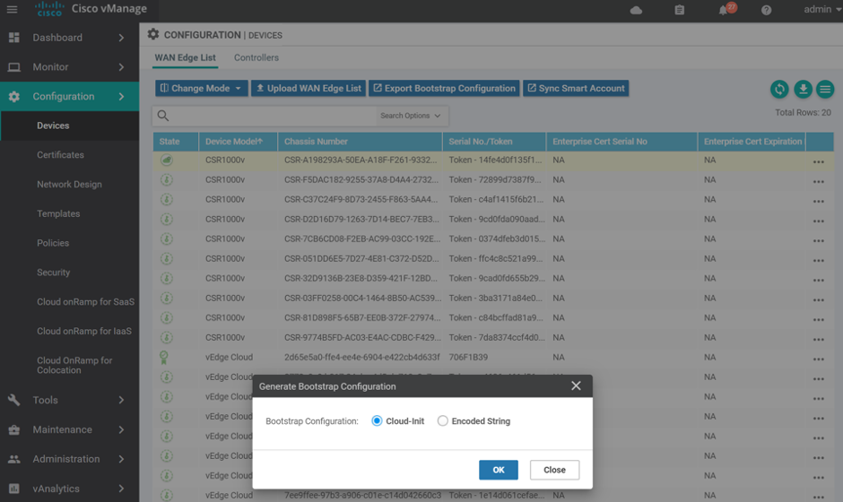

# Deploying CSR1000v in Controller Mode

## 1. Bootstrap File

### Overview

To instantiate a Virtual Router in controller mode and make sure it can register to the SD-WAN controllers (vBond, vManage, vSmart), you need to create a so called day0 configuration and pass that day0 configuration upon bootup. Upon bootup, CSR1000v/Catalyst8000v SD-WAN XE router will search bootflash: or usbflash: for filename `ciscosdwan_cloud_init.cfg`. 

In a KVM (or OpenStack) context, CSR1000v/C8000v only supports file-based **config-drive** configuration, CSR1000v/C8000v does not support meta-data or user-data as Day0 delivery mechanisms. You can **configure OpenStack** to write that file to a special **configuration drive** that attaches to the instance when it boots. The instance can mount this **drive** and read `ciscosdwan_cloud_init.cfg` from it to get information.

This day0/bootstrap file is a mime-encoded file that contains 2 sections:

- text/cloud-config
- text/cloud-boothook

**text/cloud-config**

Contains the global parameters like uuid, token, org-name, vbond, root-ca cert  viptela properties encoded in the part in YAML format and others:

- vinitparam:
  - uuid
  - vbond
  - otp
  - org
  - rcc
- ca-certs
- format-partition (vManage only)

The following example illustrates a cloud-config section:

```
Content-Type: text/cloud-config; charset="us-ascii"
MIME-Version: 1.0
Content-Transfer-Encoding: 7bit
Content-Disposition: attachment; filename="cloud-config"

#cloud-config
vinitparam:
 - otp : 5073e722b501d9fe964386d473f035ec
 - vbond : vbond1.cisco.com
 - uuid : CSR-00C7BCB9-53EC-0BFC-FBF5-B0A347D92CAB
 - org : jmb-mamatus-sdwan
```

**text/cloud-boothook**

Contains the configuration of the device (cEdge or vEdge). The following example illustrates a cloud-boothook section:

```
Content-Type: text/cloud-boothook; charset="us-ascii"
MIME-Version: 1.0
Content-Transfer-Encoding: 7bit
Content-Disposition: attachment;
 filename="config-CSR-00C7BCB9-53EC-0BFC-FBF5-B0A347D92CAB.txt"

#cloud-boothook
  system
   host-name             csr-controller
   system-ip             10.10.10.10
   overlay-id            1
   site-id               10
   port-offset           0
   control-session-pps   300
   admin-tech-on-failure
   sp-organization-name  jmb-mamatus-sdwan
   organization-name     jmb-mamatus-sdwan
   console-baud-rate     9600
   vbond vbond1.cisco.com port 12346
   
[SNIP]
```

### cloud-config

From version 17.2, “rcc” became just a binary switch. When rcc has any values, cloud-init finds ca-certs. “rcc: 1” is enough, however by giving cert itself to rcc, it can work on previous versions as well. ca-certs can be configured in the general way of cloud-init.

[Example](https://cloudinit.readthedocs.io/en/latest/topics/examples.html)

**otp** is the one time password for cloud-vedge. Giving the chassis number as uuid and serial number as otp, vEdge boots up with those information already configured.

**vbond** is it’s vbond address, and org is Organization Name. When these are in cloud-config, vEdge is initialized with those information.

**format-partition**: 1 is specifically for vManage. With it, 2nd partition of HDD will be formatted automatically. Otherwise, VM will keep wait for user to confirm to format it and initialization stops.

### cloud-boothook

Each node has confd (Tail-F confd) inside, and it is the configuration database. Entered configuration here is imported into confd CDB when it is initialized.

<br>

## 2. Creating Bootstrap file from vManage

Create a Device Template and attach that template to your device. Enter all parameters and deploy.

Then go to Configuration > Device > WAN Edge List

Click on the 3-dots on the right of a device and pick "Generate bootstrap configuration"



For KVM/Openstack select Cloud-Init. (VMWare uses Encoded String). Then click OK.

You can either download the file and SCP it across to the host server, or copy and paste the contents via a terminal to the server. Use the method you are most comfortable with. That gives you the bootstrap config that you can apply when you instantiate the VM:



vManage will generate a cloud-init file that contains the cloud-config and cloud-boothook parts. This file is MIME encoded and can be used to load the VM (ciscosdwan_cloud_init.cfg file) or for hardware device (ciscosdwan.cfg). This file has to be copied to the flash. 

Once downloaded, you can then tune this file according to your needs.

The cloud-init config file will need to be named **ciscosdwan_cloud_init.cfg** for the CSR1000v/Catalyst8000v to be able to load it.

<br>

## 3. Creating Bootstrap file using Linux tools

You can utilize “write-mime-multipart” application. It’s included in the cloud-utils package, so installation can be done in this way.

Ubuntu or Debian

```bash
# apt-get install cloud-utils
```

Redhat or CentOS

```bash
# yum install cloud-utils
```

You have to build 2 files:

+ cloud-config => cloud-config.txt
+ cloud-boothook => cloud-boothook.txt

The best option is to take a bootstrap file generated by vManage as a reference and change as required.

Example of cloud-config.txt for a CSR1000v:

```
#cloud-config
vinitparam:
 - uuid : CSR-E5E74EA5-B976-6584-CDFC-3D521AC73D24
 - vbond : 10.60.23.134
 - otp : 8c15259f59e7b815c8f272dbe58d3630
 - org : ADT Labs Paris
 - rcc : true
ca-certs:
  remove-defaults: false
  trusted:
  - |
   -----BEGIN CERTIFICATE-----
            [SNIP]
   -----END CERTIFICATE----------END CERTIFICATE-----
```

Example of cloud-boothook:

```
#cloud-boothook
  system
   host-name             csr-test
   system-ip             10.10.10.10
   overlay-id            1
   site-id               10
   port-offset           0
   control-session-pps   300
   admin-tech-on-failure
   sp-organization-name  jmb-mamatus-sdwan
   organization-name     jmb-mamatus-sdwan
   port-hop
   track-transport
   track-default-gateway
   console-baud-rate     9600
   vbond vbond1.cisco.com port 12346
   logging
    disk
     enable
    !
   !
  !
  bfd app-route multiplier 6
  bfd app-route poll-interval 600000
  omp
   no shutdown
   graceful-restart
  !
  sslproxy
   no enable
   rsa-key-modulus      2048
   certificate-lifetime 730
   eckey-type           P256
   ca-tp-label          PROXY-SIGNING-CA
   settings expired-certificate  drop
   settings untrusted-certificate drop
   settings unknown-status       drop
   settings unsupported-protocol-versions drop
   settings unsupported-cipher-suites drop
   settings failure-mode         close
   settings minimum-tls-ver      TLSv1
  !
  no tcpproxy enable
  sdwan
   interface GigabitEthernet3
    tunnel-interface
     encapsulation ipsec weight 1
     no border
     color biz-internet
     no last-resort-circuit
     no low-bandwidth-link
     no vbond-as-stun-server
     vmanage-connection-preference 5
     port-hop
     carrier                       default
     nat-refresh-interval          5
     hello-interval                1000
     hello-tolerance               12
     no allow-service all
     no allow-service bgp
     allow-service dhcp
     allow-service dns
     allow-service icmp
     allow-service sshd
     no allow-service netconf
     allow-service ntp
     no allow-service ospf
     no allow-service stun
     allow-service https
     no allow-service snmp
    exit
   exit
   appqoe
    no tcpopt enable
   !
   omp
    no shutdown
    send-path-limit  4
    ecmp-limit       4
    graceful-restart
    no as-dot-notation
    timers
     holdtime               60
     advertisement-interval 1
     graceful-restart-timer 43200
     eor-timer              300
    exit
    address-family ipv4
     advertise connected
     advertise static
    !
    address-family ipv6
     advertise connected
     advertise static
    !
   !
  !
  security
   ipsec
    rekey               86400
    replay-window       512
    authentication-type sha1-hmac ah-sha1-hmac
   !
  !
  no service pad
  service tcp-keepalives-in
  service tcp-keepalives-out
  no service tcp-small-servers
  no service udp-small-servers
  hostname csr-test
  username admin privilege 15 secret 9 $9$3V6L3V6L2VUI2k$ysPnXOdg8RLj9KgMdmfHdSHkdaMmiHzGaUpcqH6pfTo
  vrf definition Mgmt-intf
   rd 1:512
   address-family ipv4
    route-target export 1:512
    route-target import 1:512
    exit-address-family
   !
   address-family ipv6
    exit-address-family
   !
  !
  ip arp proxy disable
  no ip finger
  no ip rcmd rcp-enable
  no ip rcmd rsh-enable
  no ip dhcp use class
  ip host vbond1.cisco.com 10.10.10.1 10.10.10.2
  ip multicast route-limit 2147483647
  ip bootp server
  no ip source-route
  no ip http server
  no ip http secure-server
  no ip http ctc authentication
  no ip igmp ssm-map query dns
  interface GigabitEthernet1
   description MGMT
   no shutdown
   arp timeout 1200
   vrf forwarding Mgmt-intf
   ip address dhcp client-id GigabitEthernet1
   no ip redirects
   ip dhcp client default-router distance 1
   ip mtu    1500
   mtu         1500
   negotiation auto
  exit
  interface GigabitEthernet3
   description INET Transport
   no shutdown
   arp timeout 1200
   ip address dhcp client-id GigabitEthernet3
   no ip redirects
   ip dhcp client default-router distance 1
   ip mtu    1500
   mtu         1500
   negotiation auto
  exit
  interface Tunnel3
   no shutdown
   ip unnumbered GigabitEthernet3
   no ip redirects
   ipv6 unnumbered GigabitEthernet3
   no ipv6 redirects
   tunnel source GigabitEthernet3
   tunnel mode sdwan
  exit
  clock timezone UTC 0 0
  logging persistent size 104857600 filesize 10485760
  logging buffered 512000
  no logging rate-limit
  logging persistent
  aaa authentication login default local
  aaa authorization exec default local
  aaa session-id common
  no crypto ikev2 diagnose error
  no crypto isakmp diagnose error
  snmp-server ifindex persist
  line con 0
   login authentication default
   speed    9600
   stopbits 1
  !
  line vty 0 4
   transport input ssh
  !
  line vty 5 80
   transport input ssh
  !
  lldp run
  nat64 translation timeout tcp 60
  nat64 translation timeout udp 1
 !
!
```

When you have each data in text files, you can combine them and construct a multipart text:

+ #cloud-config => **cloud-config.txt**
+ #cloud-boothook => **cloud-boothook.txt**

```bash
# write-mime-multipart --output=ciscosdwan_cloud_init.cfg cloud-config.txt:text/cloud-config cloud-boothook.txt:text/cloud-boothook
```

<br>

## 4. Config drive - To pass Bootstrap File 

Upon bootup, CSR1000v SD-WAN XE router will search bootflash: or usbflash: for filename `ciscosdwan_cloud_init.cfg` (make sure you use the exact same name). This file is the bootstrap file generated by vManage (or by linux tools).

In a KVM (or OpenStack) context, CSR1000v/C8000v only supports file-based **config-drive** configuration, so this day0 configuration will be passed with `--config-drive` option during the instance creation.

<br>

## 5. Instantiating CSR10000v in Controller Mode with a Day0 config

### Download Image

Download image from CCO: https://software.cisco.com/download/home

Go to:

+ Downloads Home 
+ => Routers 
+ => Software-Defined WAN (SD-WAN) 
+ => XE SD-WAN Routers > CSR 1000V Series IOS XE SD-WAN

Then copy this file to your openstack cluster - this will be the image disk used by the CSR.

### Create Openstack Image

If image doesn’t exist, upload it

```bash
openstack image create --disk-format qcow2 --container-format bare --file $IMAGE_FILE $IMAGE_NAME
```

Example:

```bash
openstack image create --disk-format qcow2 --container-format bare --file csr1000v-universalk9.17.02.01prd14.qcow2 csr1000v-17.02.01
```

### Create Openstack flavor and networks

In this specific paper, I've created a flavor called `flavour_csr` and the following networks:

- Management interface (connected to vpn512): sdwan-mgt
- Internet interface (transport), connected to vpn0: mainnet
- MPLS interface (transport), connected to vpn0: sdwan-mpls
- A service VPN interface: sdwan-lan-site5

### Deploy

Deploying CSR1000v in controller mode with a day0 configuration, you have to use the `config-drive` option and give the bootstrap file that was generated in section 2 or 3 (create bootstrap file): `ciscosdwan_cloud_init.cfg`

```bash
# openstack server create --image csr1000v-17.02.01 \
   --flavor flavor_csr \
   --network sdwan-mgmt \
   --network mainnet \
   --network sdwan-mpls \
   --network sdwan-lan-site5 \
   --config-drive true \
   --file day0-config=ciscosdwan_cloud_init.cfg \
   csr5
#
```

Get VNC console

 ```
$  openstack console url show <server>
 ```

<br>

## 6. Instantiating CSR10000v in Controller Mode without a Day0 config

Deploying CSR1000v in controller mode with no day0 configuration is also possible. 

```bash
# openstack server create --image csr1000v-17.02.01 \
   --flavor flavor_csr \
   --network sdwan-mgmt \
   --network mainnet \
   --network sdwan-mpls \
   --network sdwan-lan-site5 \
   csr5
#
```

The next step is to to provide the necessary information to the virtual router to register to the controllers.

<br>

### Basic day0 configuration of CSR1000v

The best and easiest option is to create the bootstrap file from vManage - even a very basic one that contains the required parameters for the Virtual Router to connect to the controllers - create an ISO file with that bootstrap config and mount it as a CDROM. 

But if CSR1000v is instantiated without any day0 config, you have to manually create a basic configuration for the router to be able to register to the controllers and then activate the CSR1000v.

**Go to Openstack Console for the VM**

By default, the Unified image will boot in autonomous mode - Enable SD-WAN mode

```
controller-mode enable
```

If it tells you that you do not have a day0 config - that's fine - Answer the questions so you can reboot.

Once rebooted, CSR1000v is now in SD-WAN mode (controller mode) with no config.

Add the minimum configuration so you can ssh to the VM.

Enable dhcp on the interface you want to ssh to - sdwan-mgt (GigabitEthernet1), or any interface - using config-transaction

```
interface GigabitEthernet1
 no shutdown
 ip address dhcp
 negotiation auto
exit

commit
```

Then enable ssh under line vty 0 4

```
line vty 0 4
 transport input ssh
!

commit
```

ssh to your CSR1000v and cut/paste the following config - Tunnel number is interface number:

- GigabitEthernet2 => Tunnel2

```
system
 location              Toulouse
 system-ip             10.0.0.201
 site-id               20
 admin-tech-on-failure
 organization-name    <YOUR ORG NAME>
 vbond <YOUR VBOND IP>
!
interface GigabitEthernet2
 no shutdown
 ip address dhcp
 negotiation auto
exit
!
interface Tunnel2
 no shutdown
 ip unnumbered GigabitEthernet2
 tunnel source GigabitEthernet2
 tunnel mode sdwan
Exit
!
sdwan
 interface GigabitEthernet2
  tunnel-interface
   encapsulation ipsec
   color biz-internet
   no allow-service bgp
   allow-service dhcp
   allow-service dns
   allow-service icmp
   allow-service sshd
   no allow-service netconf
   no allow-service ntp
   no allow-service ospf
   no allow-service stun
   allow-service https
   no allow-service snmp
  exit
!
```

<br>

### Register CSR1000v to SD-WAN Controllers

Go to vManage > Devices

- Select a CSR1000v that is available and generate the bootstrap config - same procedure as for vEdgeCloud.

- Save UUID and OTP.

 SSH to your device, then activate the new UUID:

```
request platform software sdwan vedge_cloud activate chassis-number <UUID> token <OTP>
```

<UUID> and <TOKEN> are the values saved in the step before.

<br>

