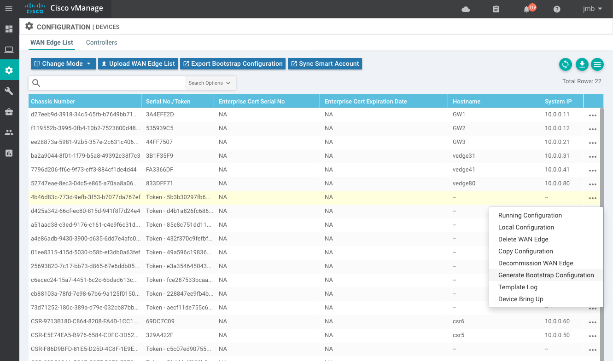
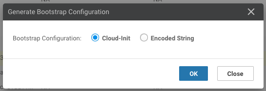

# Instantiating vEdgeCloud

## 1. Bootstrap File

To instantiate a virtual edge with a day0 configuration, you need to generate a bootstrap file from vManage or with some linux tools. This bootstrap file is mime-encoded `user-data` used by cloud-init that contains 2 sections:

- cloud-config
- cloud-boothook

| MIME                | Description                                                  |
| ------------------- | ------------------------------------------------------------ |
| text/cloud-config   | Root CA cert, viptela properties encoded in the part in YAML format and others. <br />\- ca-certs:<br />\- vinitparam<br />\- format-partition<br />\- otp<br />\- vbond<br />\- uuid<br />\- org<br />\- rcc |
| text/cloud-boothook | Configuration of the node.                                   |

The cloud-init in Viptela VM's takes the passed user-data and recognize it as a multipart data.

<br>

## 2. Creating Bootstrap file from vManage

Create a Device Template and attach that template to your device. Enter all parameters and deploy.

Then go to Configuration > Device > WAN Edge List

Click on the 3-dots on the right of a device and pick "Generate bootstrap configuration"




A popup will appear:



For KVM and Openstack select Cloud-Init. (VMWare uses Encoded String). Then click OK.

You can either download the file and SCP it across to the host server, or copy and paste the contents via a terminal to the server. Use the method you are most comfortable with. That gives you the bootstrap config that you can apply when you instantiate the VM:


vManage will generate a cloud-init file that contains the cloud-config and cloud-boothook parts. This file is MIME encoded and can be used to load the VM. 

Rename this file to `user-data` - Make sure to use that exact name.

<br>

## 3. Creating Bootstrap file using Linux tools

You can utilize “write-mime-multipart” application. It’s included in the cloud-utils package, so installation can be done in this way.

Ubuntu or Debian

```bash
# apt-get install cloud-utils
```

Redhat or CentOS

```bash
# yum install cloud-utils
```

You have to build 2 files:

+ cloud-config => **cloud-config.txt**
+ cloud-boothook => **cloud-boothook.txt**

When you have each data in text files, you can combine them and construct a multipart text.

```bash
# write-mime-multipart --output=user-data cloud-config.txt:text/cloud-config cloud-boothook.txt:text/cloud-boothook
```

Make sure the resulting file is named: user-data.

<br>

## 4. Instantiate vEdgeCloud on Openstack (with day0 config)

### Download image

Using qcow2 image on software.cisco.com

Pick image called: vEdge Cloud and vBond New Deployment KVM Image

Example: viptela-edge-20.1.1-genericx86-64.qcow2

Note: the same binary is used for vBond and vEdgeCloud.

### Flavors, Networks

Create a vEdgeCloud flavor and create required networks (in this example sdwan-mgmt, mainnet)

### Deploy

Create the vEdgeCloud server with the `user-data` file generated in section 2 or 3:

```bash
openstack server create --image vEdge_19.2.0 \
	--flavor flavor_vEdge \
	--network sdwan-mgmt \
	--network mainnet \
	--config-drive true \
	--user-data user-data \
	vedge-test
```

Get VNC console

 ```bash
openstack console url show vedge-test
 ```

### Monitoring how internal cloud-init is/was working

 cloud-init is an application working when booting up. The logs are remained in /var/log/messages.

You can see any errors when it didn't work as expected.

```bash
grep cloud-init /var/log/messages
```

<br>

## 5. Instantiate vEdgeCloud on Openstack (without day0 config)

You may want to just instantiate a vEdgeCloud without any day0 configuration, connect to the console and add the necessary information to connect to the controllers. The full configuration will then be pushed by vManage and saved locally. 

### Create a new vEdgeCloud instance

```bash
# openstack server create --image vEdge_19.2.0 --flavor flavor_vEdge --network sdwan-mgmt --network mainnet vedge-test
```

Source
- viptela-edge-20.1.1-genericx86-64.qcow2
- Create New Volume: No
- Flavor: 2 vCPU,  2 Go RAM, disk 40 Go

Networks - Order is important:
1. Add sdwan-mgmt first
2. Then sdwan-inet
3. Then sdwan-mpls


Plus any networks you need to connect to your LAN networks.


Interfaces:
- sdwan-mgmt will be connected to vEdgeCloud eth0
- mainnet will be connected to vEdgeCloud ge0/0
- sdwan-mpls will be connected to vEdgeCloud ge0/1
- sdwan-site will be connected to vEdgeCloud ge0/2

...etc

### Connect to the vEdgeCloud

Get the IP addresses allocated to your interfaces


Go to Openstack Console for the VM


Add the minimum configuration so you can ssh to the VM.


If you connect over sdwan-mgt, you should be able to connect directly - nothing required, ssh is enabled by default and you have an ip address from DHCP.


If you connect over a vpn0 interface, you have to enable ssh:

```
vpn 0
 interface ge0/0
  ip dhcp-client
  ipv6 dhcp-client
  tunnel-interface
   encapsulation ipsec
   allow-service icmp
   allow-service sshd       <====== allow SSH service
   !
   no shutdown
  !
!
```

### Register the vEdgeCloud to the controllers

Pick a uuid value => Chassis Number

Pick the otp value => token

ssh to your VM and cut/paste the a day0 configuration.

The following configuration illustrates a basic day0 configuation:

```
system
 host-name <hostname>
 system-ip <ip-address>
 site-id <site-id>
 organization-name "<YOUR ORG NAME>"
 vbond <YOUR VBOND IP>
!
vpn 0
 interface ge0/0
 ip dhcp-client
 ipv6 dhcp-client
 tunnel-interface
  encapsulation ipsec
  color mpls
  no allow-service bgp
  allow-service dhcp
  allow-service dns
  allow-service icmp
  allow-service sshd
  no allow-service netconf
  no allow-service ntp
  no allow-service ospf
  no allow-service stun
  allow-service https
 !
 no shutdown
 !
!
vpn 512
 interface eth0
 ip dhcp-client
 no shutdown
!
```

Then activate the new UUID:

```
request vedge-cloud activate chassis-number <UUID> token <OTP>
```

`<UUID>` and `<TOKEN>` are the values saved in the step before.

<br>