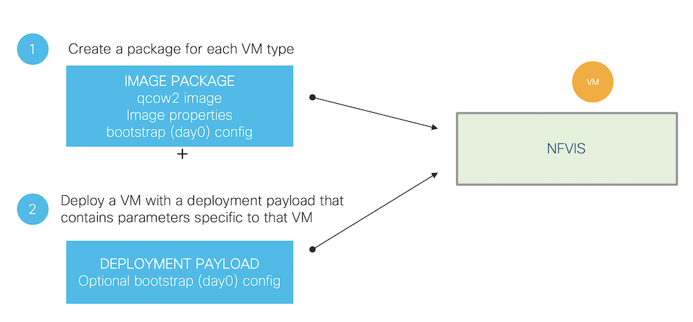

# Introduction

## NFVIS and VM Image

NFVIS is based on a Linux distribution with KVM and can deploy any VNF with a QCOW2 extension (standard KVM file format). However, NFVIS can also support additional file formats:.ISO, .IMG, .RAW

NFVIS provides users flexibility by creating a package to deploy on NFVIS, similar to creating an “OVA”. This VNF package is essentially a set of files bundled for ease of distribution and automation of deployment. VNF package typically contains the disk image(s), bootstrap configuration(s), meta-data that represents the capability, manifest file that confirms integrity.

Creating a VNF package is not mandatory however it has its advantages
-	Provides a way to scale out deployments
-	Supports Day 0 configuration (which may contain tokenized parameters) 
-	Allows definition of VM flavors

## Workflow of VM Life Cycle Management

The following depicts the basic workflow of the VM life cycle management
+ Register a VM Image—To register a VM image, you must first copy or download the relevant VM image to the NFVIS server or host the image on a http or https server. This image can be a qcow2 image or a package. Once you have downloaded the file, you can register the image using the registration API. The registration API allows you to specify the file path to the location (on the http/https server) where the tar.gz file is hosted. Registering the image is a one-time activity. Once an image is registered on the http or https server, and is in active state, you can perform multiple VM deployments using the registered image. A package should contain pre-defined flavors for the VM (called profiles). The flavor option lets you provide specific profiling details for a VM image, such as the virtual CPU on which the VM will run, and the amount of virtual memory the VM will consume
+ Customizing the Setup—After registering a VM image, you can optionally create a custom profile or flavor for the VM image if the profiles defined in the image file do not match your requirement. Depending on the topology requirement, you can create additional networks and bridges to attach the VM to during deployment.
+ Deploy a VM— A VM can be deployed using the deployment API. The deployment API allows you to provide values to the parameters that are passed to the system during deployment. Depending on the VM you are deploying, some parameters are mandatory and others optional.
+ Manage and Monitor a VM—You can monitor a VM using APIs and commands that enable you to get the VM status and debug logs. Using VM management APIs, you can start, stop, or reboot a VM, and view statistics for a VM such as CPU usage.

The following picture illustrates the two major steps to deploy a VM on NFVIS:
+	Create a package that may or may not contain a bootstrap configuration
+	Deploy the VM using a deployment payload where you specify all parameters required (interfaces, parameters values in case the package contains a tokenized bootstrap config)

## How to Package
There are at least 2 common ways to build a package.
+ Method 1. GUI approach, available via NFVIS local portal
+ Method 2. Python script based tool downloaded from NFVIS local portal

The following figure shows the NFVIS local portal:

 
The following figure shows the how to download the python script:

The packaging utility creates a tar.gz file which contains:
+ The raw QCOW2 file
+ Image properties file. (cpu, memory, interfaces, etc). created by using either the GUI or using the packaging utility provided with every release.
+ Supported and default profiles
+ Day 0 configs. (Bootstrap configuration)

## VM Bootstrap Configuration Options

You can include the bootstrap configuration (day zero configuration) of a VM in the following three ways:
-	Bundle bootstrap configuration files into the VM package—In this method, the bootstrap configuration variables can be tokenized. For each tokenized variable, key-value pairs must be provided during deployment in the deployment payload.
-	Bootstrap configuration as part of the deployment payload—The entire bootstrap configuration is copied to the payload without tokens.
-	Bootstrap configuration file in the NFVIS server—In this method, the configuration file is copied or downloaded to the NFVIS server and referenced from the deployment payload with the filename including full path.

To enable staging of bootstrap configuration files at the time of a third party VM deployment as per OpenStack standards, the following cloud init format is supported:
-	openstack/content
-	openstack/content/0000
-	openstack/content/0001
-	openstack
