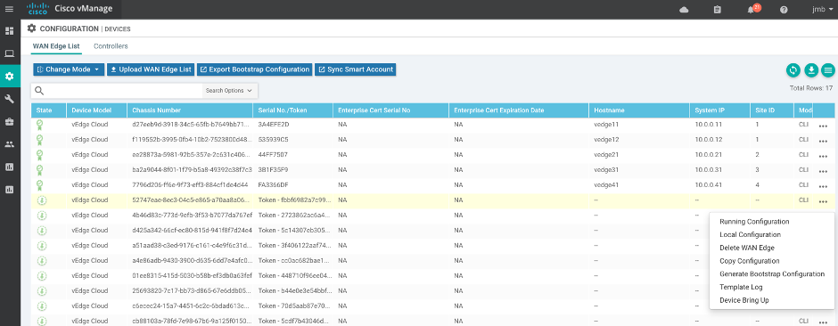
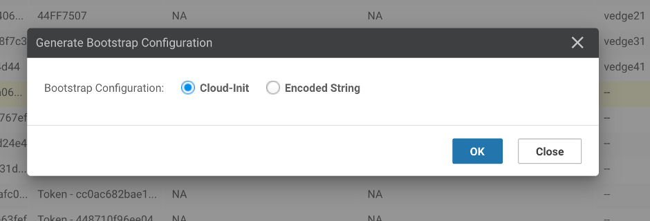

# 05 - Create vEdgeCloud Package

## Objective
Create a package file named"vedge-19.2.0.tar.gz" that contains:
-	qcow2 image
-	cloudinit.cfg 
-	meta_data
-	vendor_data
-	image_properties.xml
-	package.mf

Using the following input files:
-	viptela-edge-19.2.0-genericx86-64.qcow2
-	cloudinit.cfg: mounted as /openstack/latest/user_data  
-	meta_data: mounted as /openstack/latest/meta_data.json  
-	vendor_data: mounted as /openstack/latest/vendor_data  

cloudinit.cfg is the bootstrap configuration for the vEdgeCloud. This day0 config is included in the package and therefore needs to be tokenised to that you can change the parameters for each new deployment.

meta_data and vendor_data are not used here and are essentially empty. 

## cloud-init file format
The bootstrap config is a MIME encoded file. See [Cloudinit User-Data Formats](https://cloudinit.readthedocs.io/en/latest/topics/format.html)

The SD-WAN cloud-init file has two parts, cloud-config and cloud-boothook.
**text/cloud-config**
```
**MIME: text/cloud-config**
- Description:
- Root CA cert, viptela properties encoded in the part in YAML format and others.
     - ca-certs:
     - vinitparam
     - format-partition
     - otp
     - vbond
     - uuid
     - org
     - rcc
```

**text/cloud-boothook**

```
**MIME: text/cloud-boothook**
  <Configuration of the node>
```

## cloud-config
From version 17.2, “rcc” became just a binary switch. When rcc has any values, cloud-init finds ca-certs. “rcc: 1” is enough, however by giving cert itself to rcc, it can work on previous versions as well. ca-certs can be configured in the general way of cloud-init.

[Example](https://cloudinit.readthedocs.io/en/latest/topics/examples.html)

otp is the one time password for cloud-vedge. Giving the chassis number as uuid and serial number as otp, vEdge boots up with those information already configured.

vbond is it’s vbond address, and org is Organization Name. When these are in cloud-config, vEdge is initialized with those information.

format-partition: 1 is specifically for vManage. With it, 2nd partition of HDD will be formatted automatically. Otherwise, VM will keep wait for user to confirm to format it and initialization stops.

## cloud-boothook
Each node has confd (Tail-F confd) inside, and it is the configuration database. Entered configuration here is imported into confd CDB when it is initialized.

## Creating cloud-init file from vManage
Create a Device Template and attach that template to your device. Enter all parameters and deploy.
Then go to Configuration > Device

Click on the 3-dots on the right of a device and pick "Generate bootstrap configuration"

 
Then choose cloud-init file:


vManage will generate a cloud-init file that contains the cloud-config and cloud-boothook parts. This file is MIME encoded and can be used to load the VM or as a ciscosdwan.cfg file for hardware device. You can then tune this file according to your needs.

## Creating cloud-init file using Linux tools
You can utilize “write-mime-multipart” application. It’s included in the cloud-utils package, so installation can be done in this way.

Ubuntu or Debian
```
apt-get install cloud-utils
```

Redhat or CentOS
```
yum install cloud-utils
```

You have to build 2 files:
+ cloud-config => cloud-config.txt
+ cloud-boothook => cloud-boothook.txt

The best option is to take a bootstrap file generated by vManage as a reference and change as required.

Example of cloud-config.txt with tokenised variables

```
#cloud-config
vinitparam:
 - uuid : ${UUID}
 - vbond : ${VBOND_IP}
 - otp : ${OTP}
 - org : ${ORG_NAME}
 - rcc : true
ca-certs:
  remove-defaults: false
  trusted:
  - |
-----BEGIN CERTIFICATE-----
MIID2TCCAsGgAwIBAgIJAIVMQ5fM+2vpMA0GCSqGSIb3DQEBCwUAMIGCMQswCQYD
VQQGEwJGUjELMAkGA1UECAwCRlIxDjAMBgNVBAcMBVBhcmlzMQ4wDAYDVQQKDAVD
aXNjbzEOMAwGA1UECwwFQ2lzY28xGDAWBgNVBAMMD3Nkd2FuLmNpc2NvLmNvbTEc
MBoGCSqGSIb3DQEJARYNam1iQGNpc2NvLmNvbTAeFw0xOTA0MDMxNjEzMDFaFw0y
OTAzMzExNjEzMDFaMIGCMQswCQYDVQQGEwJGUjELMAkGA1UECAwCRlIxDjAMBgNV
BAcMBVBhcmlzMQ4wDAYDVQQKDAVDaXNjbzEOMAwGA1UECwwFQ2lzY28xGDAWBgNV
BAMMD3Nkd2FuLmNpc2NvLmNvbTEcMBoGCSqGSIb3DQEJARYNam1iQGNpc2NvLmNv
bTCCASIwDQYJKoZIhvcNAQEBBQADggEPADCCAQoCggEBAOifj+Sr5QG9mHcN8+q5
KX6CWlF1Dw69UNktqSVZlUvwgdoBM6Ewy2C8r5NwZOobK4O+FwyF4AmZJY74nGZs
8/s5nTZ8szROGZ8m5nsGd8bUl8aU8r1c1UbCmWF7uGeMPVoCgkn2fgsFl7cjgxYB
wxE5gGSKlRQYVyD+MeThu/m4TyyFYYyE7b9deidLm/eMNw7edMWmb75Dlw9KhF/p
jxe6iVGKUqawpHIXf9iCnUEkds6hD7YUxGnkMJCiY1tWA+JJZsn+ngQl6WeQU1gi
1mok6+LAQ2/uzT7BbFaKmLxMP+KnwFsXaZACnxdOa/sDYin8OEoTrB1nMVYUmwE/
u7UCAwEAAaNQME4wHQYDVR0OBBYEFIbi3PnJOnQwRiQDcg6wFbG59JdAMB8GA1Ud
IwQYMBaAFIbi3PnJOnQwRiQDcg6wFbG59JdAMAwGA1UdEwQFMAMBAf8wDQYJKoZI
hvcNAQELBQADggEBABXcsa34qk1r9UKhAHlmmDBIspjxu2bH1PkEkMyA9NNK1uoK
vplPqek+PCSlxv3Mu2OCbCMgnmHHQa/tKLLDt2WB797Vc85K2pm30UV21RV058QD
7mrLb2IHPkm1UcXG4E9CFxjWiH2FZJTrecdHnLPgkioxNieRZLa7E5UANb1XUOaG
dcVclDPupcxFbWSySdiyC1dCG4i/4gemLSpDdaewCbFXssvN8RdTK+FI5WbPAoPV
W0wCloUQDc4gsgR81QVFP2ZqIndvPdmR72LbHP4L4jtLxVIjv8iRev44VuoCOUIf
jxL61e0urJeax32rKRCC2Fwkxb5iV1jlddSjWQE=
-----END CERTIFICATE-----
```

Example of cloud-boothook with tokenised variables

```
#cloud-boothook


viptela-system:system 
personality vedge
device-model vedge-cloud
vbond ${VBOND_IP} port 12346
chassis-number ${UUID}
ztp-status success
config-template-name "branch-vedge-single"
pseudo-confirm-commit 300
!
  viptela-system:system
   personality             vedge
   device-model            vedge-cloud
   host-name               vedge91
   system-ip               ${SYSTEM_IP}
   domain-id               1
   site-id                 100
   no route-consistency-check
   sp-organization-name    "ADT Labs Paris"
   organization-name       ${ORG_NAME}
   vbond ${VBOND_IP} port 12346
   aaa
    auth-order local radius tacacs
    usergroup basic
     task system read write
     task interface read write
    !
    usergroup netadmin
    !
    usergroup operator
     task system read
     task interface read
     task policy read
     task routing read
     task security read
    !
    user admin
     password admin
    !
   !
   logging
    disk
     enable
    !
   !
  !
  omp
   no shutdown
   graceful-restart
   advertise connected
   advertise static
  !
  security
   ipsec
    authentication-type sha1-hmac ah-sha1-hmac
   !
  !
  vpn 0
   name "Transport VPN"
   interface ge0/0
    ip dhcp-client
    tunnel-interface
     encapsulation ipsec
     no allow-service bgp
     allow-service dhcp
     allow-service dns
     allow-service icmp
     allow-service sshd
     allow-service netconf
     allow-service ntp
     no allow-service ospf
     no allow-service stun
    !
    no shutdown
   !
  !
  vpn 512
   interface eth0
    ip address ${NICID_0_IP_ADDRESS}/${NICID_0_CIDR_PREFIX}
    no shutdown
  !
 !
!
```

When you have each data in text files, you can combine them and construct a multipart text.
```
$ write-mime-multipart --output=cloudinit.cfg cloud-config.txt:text/cloud-config cloud-boothook.txt:text/cloud-boothook
```

Cloud-init Example:
```
Content-Type: multipart/mixed; boundary="===============0947779458718515303=="
MIME-Version: 1.0

--===============0947779458718515303==
Content-Type: text/cloud-config; charset="us-ascii"
MIME-Version: 1.0
Content-Transfer-Encoding: 7bit
Content-Disposition: attachment; filename="cloud-config.txt"

#cloud-config
vinitparam:
 - uuid : ${UUID}
 - vbond : ${VBOND_IP}
 - otp : ${OTP}
 - org : ${ORG_NAME}
 - rcc : true
ca-certs:
  remove-defaults: false
  trusted:
  - |
-----BEGIN CERTIFICATE-----
MIID2TCCAsGgAwIBAgIJAIVMQ5fM+2vpMA0GCSqGSIb3DQEBCwUAMIGCMQswCQYD
VQQGEwJGUjELMAkGA1UECAwCRlIxDjAMBgNVBAcMBVBhcmlzMQ4wDAYDVQQKDAVD
aXNjbzEOMAwGA1UECwwFQ2lzY28xGDAWBgNVBAMMD3Nkd2FuLmNpc2NvLmNvbTEc
MBoGCSqGSIb3DQEJARYNam1iQGNpc2NvLmNvbTAeFw0xOTA0MDMxNjEzMDFaFw0y
OTAzMzExNjEzMDFaMIGCMQswCQYDVQQGEwJGUjELMAkGA1UECAwCRlIxDjAMBgNV
BAcMBVBhcmlzMQ4wDAYDVQQKDAVDaXNjbzEOMAwGA1UECwwFQ2lzY28xGDAWBgNV
BAMMD3Nkd2FuLmNpc2NvLmNvbTEcMBoGCSqGSIb3DQEJARYNam1iQGNpc2NvLmNv
bTCCASIwDQYJKoZIhvcNAQEBBQADggEPADCCAQoCggEBAOifj+Sr5QG9mHcN8+q5
KX6CWlF1Dw69UNktqSVZlUvwgdoBM6Ewy2C8r5NwZOobK4O+FwyF4AmZJY74nGZs
8/s5nTZ8szROGZ8m5nsGd8bUl8aU8r1c1UbCmWF7uGeMPVoCgkn2fgsFl7cjgxYB
wxE5gGSKlRQYVyD+MeThu/m4TyyFYYyE7b9deidLm/eMNw7edMWmb75Dlw9KhF/p
jxe6iVGKUqawpHIXf9iCnUEkds6hD7YUxGnkMJCiY1tWA+JJZsn+ngQl6WeQU1gi
1mok6+LAQ2/uzT7BbFaKmLxMP+KnwFsXaZACnxdOa/sDYin8OEoTrB1nMVYUmwE/
u7UCAwEAAaNQME4wHQYDVR0OBBYEFIbi3PnJOnQwRiQDcg6wFbG59JdAMB8GA1Ud
IwQYMBaAFIbi3PnJOnQwRiQDcg6wFbG59JdAMAwGA1UdEwQFMAMBAf8wDQYJKoZI
hvcNAQELBQADggEBABXcsa34qk1r9UKhAHlmmDBIspjxu2bH1PkEkMyA9NNK1uoK
vplPqek+PCSlxv3Mu2OCbCMgnmHHQa/tKLLDt2WB797Vc85K2pm30UV21RV058QD
7mrLb2IHPkm1UcXG4E9CFxjWiH2FZJTrecdHnLPgkioxNieRZLa7E5UANb1XUOaG
dcVclDPupcxFbWSySdiyC1dCG4i/4gemLSpDdaewCbFXssvN8RdTK+FI5WbPAoPV
W0wCloUQDc4gsgR81QVFP2ZqIndvPdmR72LbHP4L4jtLxVIjv8iRev44VuoCOUIf
jxL61e0urJeax32rKRCC2Fwkxb5iV1jlddSjWQE=
-----END CERTIFICATE-----


--===============0947779458718515303==
Content-Type: text/cloud-boothook; charset="us-ascii"
MIME-Version: 1.0
Content-Transfer-Encoding: 7bit
Content-Disposition: attachment; filename="cloud-boothook.txt"

#cloud-boothook


viptela-system:system
personality vedge
device-model vedge-cloud
vbond ${VBOND_IP} port 12346
chassis-number ${UUID}
ztp-status success
config-template-name "branch-vedge-single"
pseudo-confirm-commit 300
!
  viptela-system:system
   personality             vedge
   device-model            vedge-cloud
   host-name               vedge91
   system-ip               ${SYSTEM_IP}
   domain-id               1
   site-id                 100
   no route-consistency-check
   sp-organization-name    "ADT Labs Paris"
   organization-name       ${ORG_NAME}
   vbond ${VBOND_IP} port 12346
   aaa
    auth-order local radius tacacs
    usergroup basic
     task system read write
     task interface read write
    !
    usergroup netadmin
    !
    usergroup operator
     task system read
     task interface read
     task policy read
     task routing read
     task security read
    !
    user admin
     password admin
    !
   !
   logging
    disk
     enable
    !
   !
  !
  omp
   no shutdown
   graceful-restart
   advertise connected
   advertise static
  !
  security
   ipsec
    authentication-type sha1-hmac ah-sha1-hmac
   !
  !
  vpn 0
   name "Transport VPN"
   interface ge0/0
    ip dhcp-client
    tunnel-interface
     encapsulation ipsec
     no allow-service bgp
     allow-service dhcp
     allow-service dns
     allow-service icmp
     allow-service sshd
     allow-service netconf
     allow-service ntp
     no allow-service ospf
     no allow-service stun
    !
    no shutdown
   !
  !
  vpn 512
   interface eth0
    ip address ${NICID_0_IP_ADDRESS}/${NICID_0_CIDR_PREFIX}
    no shutdown
  !
 !
!

--===============0947779458718515303==--
```


**IMPORTANT NOTE:**
> ${NICID_0_IP_ADDRESS}, ${NICID_0_NETMASK} and ${NICID_0_CIDR_PREFIX} are reserved parameters. The VM Lifecycle Manager (ESC-Lite) on NFVIS will replace these variables with values assigned by ESC-Lite. This is used for the int-mgmt-net addresses. They are assigned by NFVIS and not by DHCP.

## Create vEdge package

Create vEdgeCloud package for 19.2.0 using nfvpt from NFVIS 3.11:
```
/usr/bin/python ./nfvpt.py -o vedge_19.2.0 -i viptela-edge-19.2.0-genericx86-64.qcow2  -n vedge-19.2.0 -t ROUTER -r 19.2.0 --monitored true --privileged true --optimize false --bootstrap /openstack/latest/user_data:cloudinit.cfg,/openstack/latest/meta_data.json:meta_data,/openstack/latest/vendor_data.json:vendor_data --min_vcpu 2 --max_vcpu 8 --min_mem 4096 --max_mem 8192 --min_disk 8 --max_disk 8 --vnic_max 8 --optimize true --nocloud true --profile vedge-small,"vEdge small profile",2,4096,8192 --profile vedge-standard,"vEdge standard profile",4,4096,8192 --default_profile vedge-standard --custom key:UUID,val:1 --custom key:OTP,val:1 --custom key:SYSTEM_IP,val:10.0.0.100 --custom key:ORG_NAME,val:test --custom key:VBOND_IP,val:1.1.1.1
```

Where:
+ vendor_data: is empty
+ user_date: is empty
+ cloudinit.cfg: contains the bootstrap configuration for vEdge

