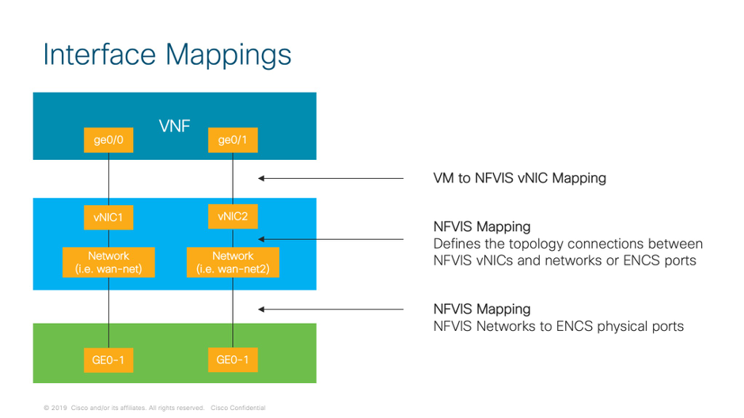

# 08 - Deploy VM

## Introduction
A deployment payload is used to spin up a VM, it contains:
-	VM name
-	The VM image used - this is the package name that has be registered in NFVIS the previous section.
-	The flavour used
-	port forwarding
-	vNIC to network mappings
-	Monitoring parameters
-	etc

## NFVIS Interfaces
By default, the first interface of the deployed VM will be used for internal monitoring. This behaviour can be changed with the deployment payload.

The following picture illustrates the mapping between the VM interfaces names, the NFVIS vNICs and NFVIS networks.



The first interface of the deployed VM will be used for internal monitoring. 
-	By default local portal attaches vNIC0 of the monitored VM to int-mgmt-net.
-	If the VM fails to respond to heartbeat from the NFVIS, after 3 attempts of re-launching the VM, the Status will report 'Error'. However, the vEdge Cloud running in the VM is still operational

vEdge Cloud

vEdgeCloud	NFVIS vNIC
eth0	vNIC0
ge0/0	vNIC1
ge0/1	vNIC2
ge0/2	vNIC3

ISRv
ISRv	NFVIS vNIC
GigabitEthernet1	vNIC0
GigabitEthernet2	vNIC1
GigabitEthernet3	vNIC2
GigabitEthernet14	vNIC3

Ubuntu Cloud
Ubuntu	NFVIS vNIC
ens3	vNIC0
ens4	vNIC1

## Port Forwarding

In networking port forwarding is an application of network address translation (NAT) that redirects a communication request from one address and port number combination to another while the packets are traversing a network gateway. 

NFVIS supports port forwarding which allows to ssh to NFVIS using a pre-defined port, and NFVIS will forward the request to the VM using the int-mgmt-net network. The VM has to be monitored and connected to int-mgmt-net for port forwarding to work.

VM port forwarding cannot be configured dynamically. It can be configured only at the time of VM deployment.

Configuration notes:
+ network: must be int-mgmt-net if port-forwarding is configured
+ ip_address: It must be an un-used IP from int-mgmt-net/-subnet pool.
	- If VM has capability to pass day-0 and has tokenized this parameter in day-0 to be attached, use may not set this parameter as NFVIS can auto assign IP address (from int-mgmt-net / -subnet) pool. Example of this: ISRv, vEdgeCloud
	- If VM cannot get day-0, this parameter must be set with an un-used IP address from int-mgmt-net / -subnet IP address pool. 
+ Port-forwarding can only be configured in initial VM deployment. It is not supported to update VM’s port-forwarding post VM deployment.

VM:
+ For VMs that cannot pass day-0 configuration, user has to access VM (e.g. via VNC) and manually assign the IP address specified above to VM’s interface attached to int-mgmt-net.
+ Depending on the port configured, VM must have proper service set up and run to accept the traffic on that port.
-	For an example, VM must have sshd service run if port is set to ssh. Otherwise accessing VM via “ssh <vm_user>@<nfvis_ip> -p 2224” will fail.  

Port forwarding Sample Deployment Payload
```
<port_forwarding>
  <port>
    <type>ssh</type>
    <protocol>tcp</protocol>
    <vnf_port>22</vnf_port>
    <external_port_range>
      <start>20122</start>
      <end>20122</end>
    </external_port_range>
  </port>
  <port>
    <type>telnet</type>
    <protocol>tcp</protocol>
    <vnf_port>23</vnf_port>
    <external_port_range>
      <start>20123</start>
      <end>20123</end>
    </external_port_range>
  </port>
</port_forwarding>
```

By default the wan bridge interface "wan-br" is used to redirect the incoming traffic from WAN to access the internal management network(int-mgmt-net) of VNFs.

The bridge interface that is used to redirect the traffic coming from wan side can be modified using the "source_bridge" tag in the deployment payload.

Port forwarding Sample Deployment Payload
```
<port_forwarding>
  <port>
  <type>ssh</type>
  <protocol>tcp</protocol>
  <vnf_port>22</vnf_port>
  <source_bridge>MGMT</source_bridge>
  <external_port_range>
    <start>20122</start>
    <end>20122</end>
  </external_port_range>
  </port>
</port_forwarding>
```

## NFVIS Networks
Verify that all networks required for your deployment are configured.
```
curl -k -v -u "admin:admin" -H content-type:application/vnd.yang.data+xml -X GET https://10.60.23.12/api/config/networks\?deep
```

Create bridge (service-br)
```
curl -k -v -u admin:admin -H "content-type: application/vnd.yang.data+xml" -X POST https://10.60.23.12/api/config/bridges --data '<bridge><name>service-br</name></bridge>'
```

Create network (service-net)
```
curl -k -v -u admin:admin -H "content-type: application/vnd.yang.data+xml" -X POST https://10.60.23.12/api/config/networks --data '<network><name>service-net</name><bridge>service-br</bridge></network>'
```

Retrieve bridge info
```
curl -k -v -u admin:admin "https://10.60.23.12/api/config/bridges?deep"
```

Retrieve network info
```
curl -k -v -u admin:admin "https://10.60.23.12/api/config/networks?deep"
```


## Deploy vEdgeCloud VM Using package
The VM package is already on NFVIS. Refer to section "Register Package". You can perform multiple VM deployments using the same registered image.

Before deploying the VM, you can perform a resource check to ensure that you have sufficient resources for the deployment. Check with the flavor you plan to use:
```
curl -k -v -u "admin:admin" -X GET https://10.60.23.12/api/operational/resources/precheck/vnf/newvnf,vedge-small,true?deep
```

Deploy a VM using a Deployment Payload “deploy_vedge.xml”
```
curl -k -v -u "admin:Fun_Nfvis1" -H Accept:application/vnd.yang.data+xml -H Content-Type:application/vnd.yang.data+xml -X POST https://10.60.23.12/api/config/vm_lifecycle/tenants/tenant/admin/deployments --data "@deploy_vedge.xml"
```

Example: deploy_vedge.xml
```
<deployment>
    <name>vEdge</name>
    <vm_group>
        <name>vEdge</name>
        <image>vedge-18.4.0</image>
        <flavor>vedge-small</flavor>
        <vim_vm_name>vEdge</vim_vm_name>
        <bootup_time>-1</bootup_time>
        <recovery_wait_time>0</recovery_wait_time>
        <interfaces>
            <interface>
                <nicid>0</nicid>
                <network>int-mgmt-net</network>
                <port_forwarding>
                    <port>
                        <type>ssh</type>
                        <protocol>tcp</protocol>
                        <vnf_port>22</vnf_port>
                        <external_port_range>
                            <start>20022</start>
                            <end>20022</end>
                        </external_port_range>
                    </port>
                </port_forwarding>
            </interface>
            <interface>
                <nicid>1</nicid>
                <network>wan-net</network>
            </interface>
            <interface>
                <nicid>2</nicid>
                <network>lan-net</network>
            </interface>
        </interfaces>
        <scaling>
            <min_active>1</min_active>
            <max_active>1</max_active>
        </scaling>
        <placement>
            <type>zone_host</type>
            <host>datastore1</host>
        </placement>
        <recovery_policy>
            <action_on_recovery>REBOOT_ONLY</action_on_recovery>
        </recovery_policy>
        <config_data>
            <configuration>
                <dst>bootstrap_config</dst>
                <variable>
                    <name>SYSTEM_IP</name>
                    <val>10.0.0.91</val>
                </variable>
                <variable>
                    <name>UUID</name>
                    <val>52747eae-8ec3-04c5-e865-a70aa8a06239</val>
                </variable>
                <variable>
                    <name>OTP</name>
                    <val>fbbf6982a7c993aa730c4fa5a13ed571</val>
                </variable>
                <variable>
                    <name>ORG_NAME</name>
                    <val>ADT Labs Paris</val>
                </variable>
                <variable>
                    <name>VBOND_IP</name>
                    <val>10.49.234.79</val>
                </variable>
            </configuration>
        </config_data>
    </vm_group>
</deployment>
```

Verify deployment status using NFVIS CLI to check what IP address has been allocated to the VM. In the example below, VM has 10.20.0.4.
```
UCPE-PARIS# show vm_lifecycle opdata tenants tenant
vm_lifecycle opdata tenants tenant admin
 tenant_id adminUUID
 networks network int-mgmt-net
  netid                 81393e59-610a-4a52-be52-3db8716772b1
  shared                true
  admin_state           true
  provider_network_type local
  status                active
                                                                                    NO
NAME                 SUBNETID                              CIDR          GATEWAY    GATEWAY  DHCP   IPVERSION
---------------------------------------------------------------------------------------------------------------
int-mgmt-net-subnet  29a679ef-1463-4eac-b5aa-77a9f0a9441c  10.20.0.0/24  10.20.0.1  false    false  4

 deployments 1548431883
  deployment_id SystemAdminTenantId1548431883
  vm_group ROUTER
   vm_instance 3e413215-1c30-4e3d-9dd4-4c4e6af2014a
    name     1548431883_ROUTER_0_13964ec4-6880-4392-a427-66aaea839ad5
    host_id  NFVIS
    hostname UCPE-PARIS
                        PORT                         IP                                                        SECURITY  PORT  PORT
NICID  MODEL   TYPE     ID     NETWORK       SUBNET  ADDRESS    MAC ADDRESS        NETMASK          GATEWAY    GROUPS    TYPE  NUMBER
---------------------------------------------------------------------------------------------------------------------------------------
0      virtio  virtual  vnic0  int-mgmt-net  N/A     10.20.0.4  52:54:00:38:bd:f0  255.255.255.0    10.20.0.1  -         ssh   22022
1      virtio  virtual  vnic1  wan-net       N/A     -          52:54:00:d7:b3:ad  255.255.255.255  0.0.0.0    -
2      virtio  virtual  vnic2  lan-net       N/A     -          52:54:00:08:21:15  -                -          -

  state_machine state SERVICE_ACTIVE_STATE
VM NAME                                                   STATE
--------------------------------------------------------------------------
1548431883_ROUTER_0_13964ec4-6880-4392-a427-66aaea839ad5  VM_ALIVE_STATE

UCPE-PARIS#
```

IMPORTANT NOTE:
+ If the package has monitoring enabled in the image properties file:
	- <monitoring_supported>true</monitoring_supported>
+ Then make sure the VM interface mapped to int-mgmt-net has the IP address listed above and is able to ping the gateway: 10.20.0.1. Otherwise NFVIS will display the VM as “booting”

Verify the deployment status using the following API method. This will list of all the VMs running.
```
curl -k -v -u admin:Fun_Nfvis1 -H Accept:application/vnd.yang.data+xml -H Content-Type:application/vnd.yang.data+xml -X GET https://10.60.23.12/api/operational/vm_lifecycle/tenants/tenant/admin
```

Get detailed information about the deployment:
```
curl -k -v -u "admin:Fun_Nfvis1" -H Accept:application/vnd.yang.data+xml -H Content-Type:application/vnd.yang.data+xml -X GET https://10.60.23.12/api/operational/vm_lifecycle/opdata/tenants/tenant/admin/deployments/vEdge?deep
```

Note: Replace “vEdge” with the name of the VM running on NFVIS.

Response:
```
<deployments xmlns="http://www.cisco.com/nfvis/vm_lifecycle" xmlns:y="http://tail-f.com/ns/rest"  xmlns:vmlc="http://www.cisco.com/nfvis/vm_lifecycle">
  <deployment_name>vEdge</deployment_name>
  <deployment_id>SystemAdminTenantIdvEdge</deployment_id>
  <vm_group>
    <name>vEdge</name>
    <vm_instance>
      <vm_id>4f4bfb3c-dc79-4bc1-b86c-c7bea11dc221</vm_id>
      <name>vEdge_vEdge_0_a5da08f7-8813-495a-b49d-62f0d4665469</name>
      <host_id>NFVIS</host_id>
      <hostname>nfvis</hostname>
      <interfaces>
        <interface>
          <nicid>0</nicid>
          <model>virtio</model>
          <type>virtual</type>
          <port_id>vnic12</port_id>
          <network>int-mgmt-net</network>
          <subnet>N/A</subnet>
          <ip_address>10.20.0.11</ip_address>
          <mac_address>52:54:00:24:15:8e</mac_address>
          <netmask>255.255.255.0</netmask>
          <gateway>10.20.0.1</gateway>
          <port_forwards>
            <port_forward>
              <port_type>ssh</port_type>
              <port_number>20022</port_number>
            </port_forward>
          </port_forwards>
        </interface>
        <interface>
          <nicid>1</nicid>
          <model>virtio</model>
          <type>virtual</type>
          <port_id>vnic13</port_id>
          <network>wan-net</network>
          <subnet>N/A</subnet>
          <ip_address>172.16.2.66</ip_address>
          <mac_address>52:54:00:70:f1:db</mac_address>
          <netmask>255.255.0.0</netmask>
          <gateway>172.16.2.70</gateway>
        </interface>
        <interface>
          <nicid>2</nicid>
          <model>virtio</model>
          <type>virtual</type>
          <port_id>vnic14</port_id>
          <network>lan-net</network>
          <subnet>N/A</subnet>
          <ip_address>20.1.1.1</ip_address>
          <mac_address>52:54:00:c3:62:28</mac_address>
          <netmask>255.255.255.0</netmask>
          <gateway>20.1.1.1</gateway>
        </interface>
      </interfaces>
    </vm_instance>
  </vm_group>
  <state_machine>
    <state>SERVICE_ERROR_STATE</state>
    <vm_state_machines>
      <vm_state_machine>
        <vm_name>vEdge_vEdge_0_a5da08f7-8813-495a-b49d-62f0d4665469</vm_name>
        <state>VM_ERROR_STATE</state>
      </vm_state_machine>
    </vm_state_machines>
  </state_machine>
</deployments>
```


## Deploy Ubuntu VM Using package

Deploy a VM using a Deployment Payload “deploy.xml”
```
curl -k -v -u "admin:C1sc0123#" -H Accept:application/vnd.yang.data+xml -H Content-Type:application/vnd.yang.data+xml -X POST https://10.60.20.23/api/config/vm_lifecycle/tenants/tenant/admin/deployments --data "@deploy.xml"
```

deploy.xml example:
```
<deployment>
    <name>UBUNTU</name>
    <vm_group>
        <name>UBUNTU</name>
        <image>ubuntu-bionic</image>
        <flavor>ubuntu-tiny</flavor>
        <vim_vm_name>UBUNTU</vim_vm_name>
        <bootup_time>600</bootup_time>
        <recovery_wait_time>5</recovery_wait_time>
        <interfaces>
            <interface>
                <nicid>0</nicid>
                <network>int-mgmt-net</network>
                <port_forwarding>
                    <port>
                        <type>ssh</type>
                        <protocol>tcp</protocol>
                        <vnf_port>22</vnf_port>
                        <source_bridge>wan-br</source_bridge>
                        <external_port_range>
                            <start>20022</start>
                            <end>20022</end>
                        </external_port_range>
                    </port>
                </port_forwarding>
            </interface>
            <interface>
                <nicid>0</nicid>
                <network>int-mgmt-net</network>
            </interface>
            <interface>
                <nicid>1</nicid>
                <network>wan-net</network>
            </interface>
        </interfaces>
        <scaling>
            <min_active>1</min_active>
            <max_active>1</max_active>
        </scaling>
        <placement>
            <type>zone_host</type>
            <host>datastore1</host>
        </placement>
        <kpi_data>
            <kpi>
                <event_name>VM_ALIVE</event_name>
                <metric_value>1</metric_value>
                <metric_cond>GT</metric_cond>
                <metric_type>UINT32</metric_type>
                <metric_collector>
                    <type>ICMPPing</type>
                    <nicid>0</nicid>
                    <poll_frequency>3</poll_frequency>
                    <polling_unit>seconds</polling_unit>
                    <continuous_alarm>false</continuous_alarm>
                </metric_collector>
            </kpi>
        </kpi_data>
        <rules>
            <admin_rules>
                <rule>
                    <event_name>VM_ALIVE</event_name>
                    <action>ALWAYS log</action>
                    <action>TRUE servicebooted.sh</action>
                    <action>FALSE recover autohealing</action>
                </rule>
            </admin_rules>
        </rules>
        <config_data>
            <configuration>
                <dst>bootstrap_config</dst>
                <variable>
                    <name>IP_ADDRESS</name>
                    <val>10.1.1.100</val>
                </variable>
                <variable>
                    <name>NETMASK</name>
                    <val>255.255.255.0</val>
                </variable>
                <variable>
                    <name>GATEWAY</name>
                    <val>10.1.1.1</val>
                </variable>
            </configuration>
        </config_data>
    </vm_group>
</deployment>
```

Verify the deployment status using the following API method. This will list of all the VMs running.
```
curl -k -v -u "admin:admin" -H Accept:application/vnd.yang.data+xml -H Content-Type:application/vnd.yang.data+xml -X GET https://10.60.20.23/api/operational/vm_lifecycle/tenants/tenant/admin
```

For more details, check the operational Data:
```
curl -k -v -u "admin:admin" -H Accept:application/vnd.yang.data+xml -H Content-Type:application/vnd.yang.data+xml -X GET https://10.60.20.23/api/operational/vm_lifecycle/opdata/tenants/tenant/admin
```

Response
```
<tenant xmlns="http://www.cisco.com/nfvis/vm_lifecycle" xmlns:y="http://tail-f.com/ns/rest"  xmlns:vmlc="http://www.cisco.com/nfvis/vm_lifecycle">
  <name>admin</name>
  <tenant_id>adminUUID</tenant_id>
  <networks>
    <network>
      <name>int-mgmt-net</name>
    </network>
  </networks>
  <deployments>
    <deployment_name>1539809613</deployment_name>
  </deployments>
  <deployments>
    <deployment_name>vEdge</deployment_name>
  </deployments>
</tenant>
```

Check the VM status directly on NFVIS
```
nfvis-2# show vm_lifecycle opdata tenants tenant admin deployments UBUNTU
deployments UBUNTU
 deployment_id SystemAdminTenantIdUBUNTU
 vm_group UBUNTU
  vm_instance ec8106c2-eb9c-4a4c-9df7-be017b2bef9e
   name     UBUNTU
   host_id  NFVIS
   hostname nfvis-2
                        PORT                          IP                                                      SECURITY  PORT  PORT    SOURCE
NICID  MODEL   TYPE     ID      NETWORK       SUBNET  ADDRESS    MAC ADDRESS        NETMASK        GATEWAY    GROUPS    TYPE  NUMBER  BRIDGE
----------------------------------------------------------------------------------------------------------------------------------------------
0      virtio  virtual  vnic16  int-mgmt-net  N/A     10.20.0.5  52:54:00:df:9f:ac  255.255.255.0  10.20.0.1  -         ssh   20022   wan-br
1      virtio  virtual  vnic19  wan-net       N/A     -          52:54:00:2c:83:eb  -              -          -


 state_machine state SERVICE_ACTIVE_STATE
VM
NAME    STATE
------------------------
UBUNTU  VM_INERT_STATE


nfvis-2#
```


## Management Network

To check the subnet used by NFVIS Management Network:
```
vm_lifecycle opdata networks network int-mgmt-net
 netid                 81393e59-610a-4a52-be52-3db8716772b1
 shared                true
 admin_state           true
 provider_network_type local
 status                active
                                                                                    NO
NAME                 SUBNETID                              CIDR          GATEWAY    GATEWAY  DHCP   IPVERSION
---------------------------------------------------------------------------------------------------------------
int-mgmt-net-subnet  29a679ef-1463-4eac-b5aa-77a9f0a9441c  10.20.0.0/24  10.20.0.1  false    false  4

UCPE-PARIS#
```

To check what IP address has been allocated to the VM
In the example below, VM has 10.20.0.4.
```
vm_lifecycle opdata tenants tenant admin
 tenant_id adminUUID
 networks network int-mgmt-net
  netid                 81393e59-610a-4a52-be52-3db8716772b1
  shared                true
  admin_state           true
  provider_network_type local
  status                active
                                                                                    NO
NAME                 SUBNETID                              CIDR          GATEWAY    GATEWAY  DHCP   IPVERSION
---------------------------------------------------------------------------------------------------------------
int-mgmt-net-subnet  29a679ef-1463-4eac-b5aa-77a9f0a9441c  10.20.0.0/24  10.20.0.1  false    false  4

 deployments 1548431883
  deployment_id SystemAdminTenantId1548431883
  vm_group ROUTER
   vm_instance 3e413215-1c30-4e3d-9dd4-4c4e6af2014a
    name     1548431883_ROUTER_0_13964ec4-6880-4392-a427-66aaea839ad5
    host_id  NFVIS
    hostname UCPE-PARIS
                        PORT                         IP                                                        SECURITY  PORT  PORT
NICID  MODEL   TYPE     ID     NETWORK       SUBNET  ADDRESS    MAC ADDRESS        NETMASK          GATEWAY    GROUPS    TYPE  NUMBER
---------------------------------------------------------------------------------------------------------------------------------------
0      virtio  virtual  vnic0  int-mgmt-net  N/A     10.20.0.4  52:54:00:38:bd:f0  255.255.255.0    10.20.0.1  -         ssh   22022
1      virtio  virtual  vnic1  wan-net       N/A     -          52:54:00:d7:b3:ad  255.255.255.255  0.0.0.0    -
2      virtio  virtual  vnic2  lan-net       N/A     -          52:54:00:08:21:15  -                -          -

  state_machine state SERVICE_ACTIVE_STATE
VM NAME                                                   STATE
--------------------------------------------------------------------------
1548431883_ROUTER_0_13964ec4-6880-4392-a427-66aaea839ad5  VM_ALIVE_STATE

UCPE-PARIS#
```

## Un-deploy a VM

Command
```
curl -k -v -u "admin:Fun_Nfvis1" -H Accept:application/vnd.yang.data+xml -H Content-Type:application/vnd.yang.data+xml -X DELETE https://10.60.20.23/api/config/vm_lifecycle/tenants/tenant/admin/deployments/deployment/vEdge.vEdge
```

Note: replace *vEdge.vEdge* with the name of the deployed VM.
